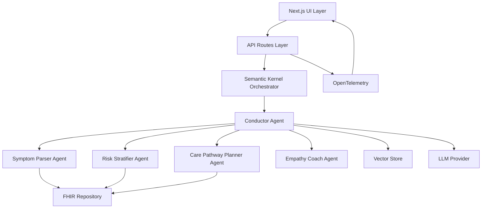
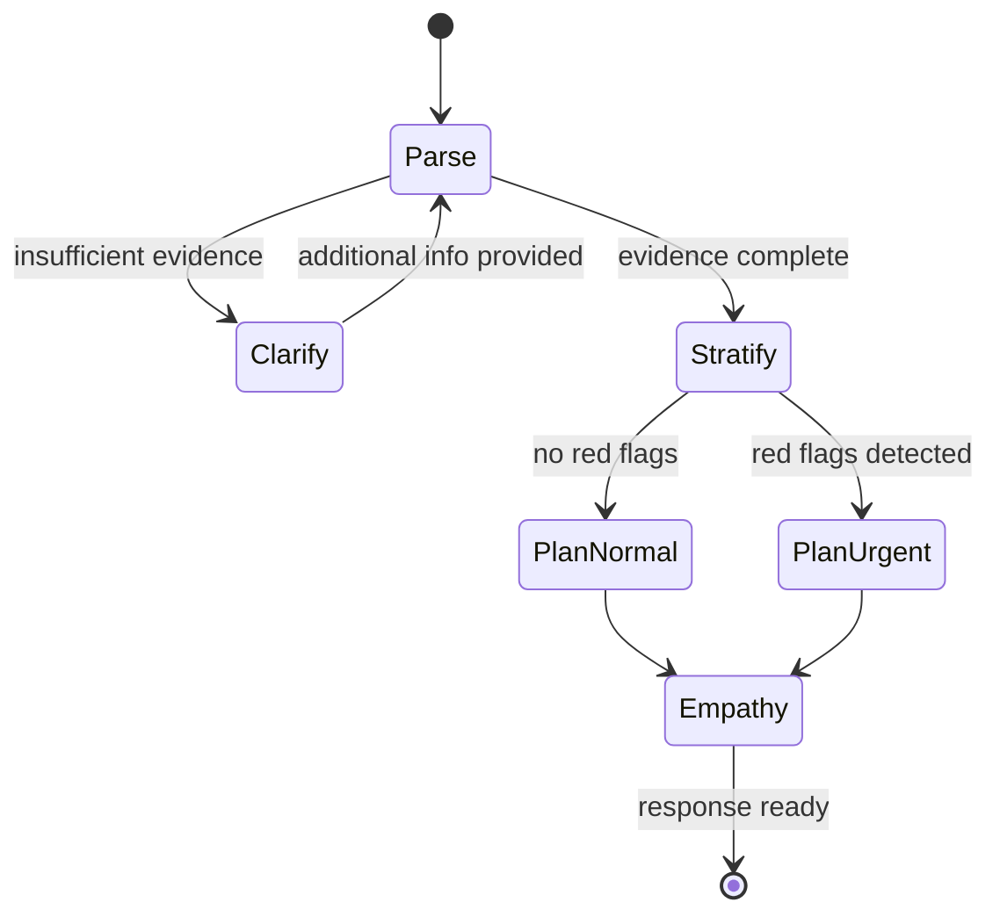
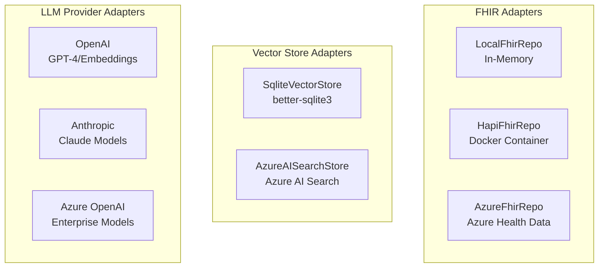
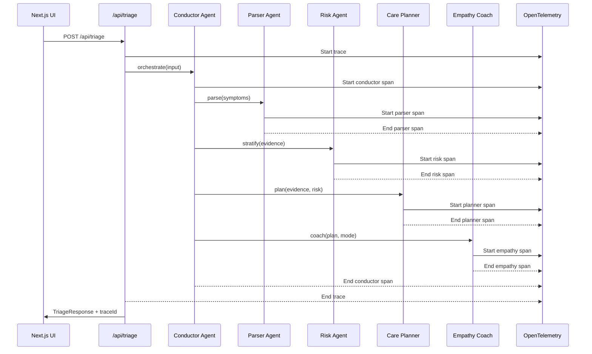
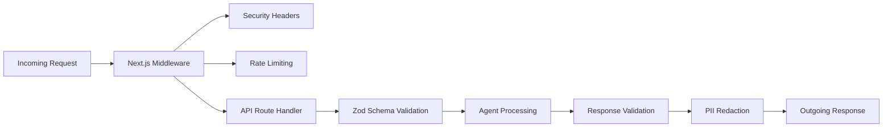
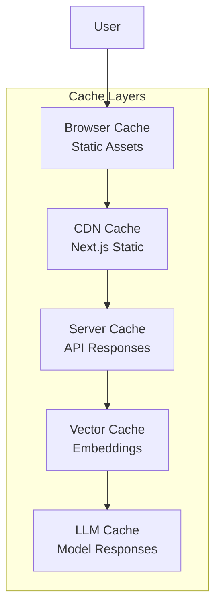
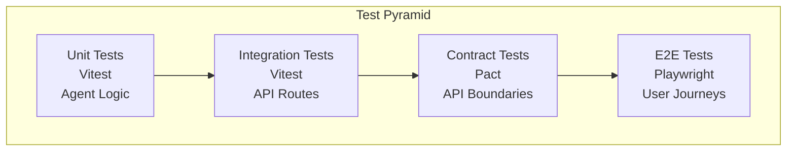
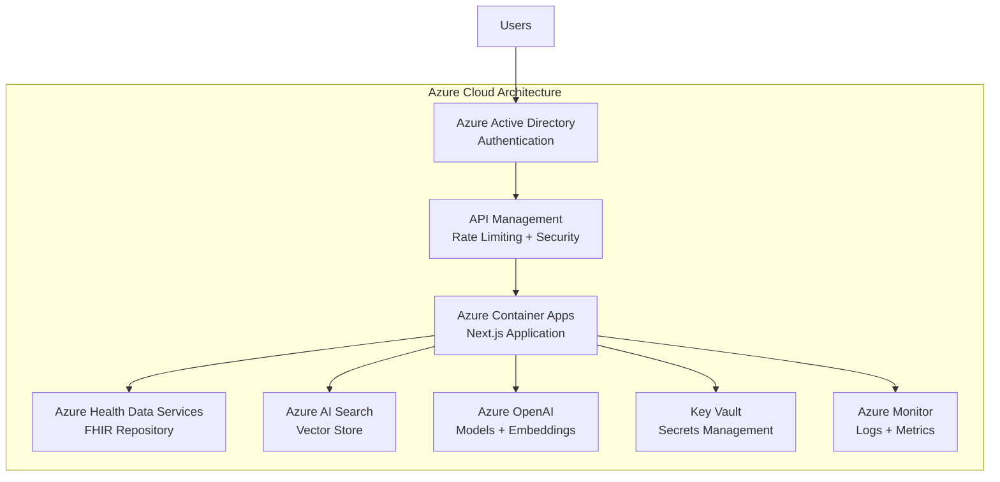
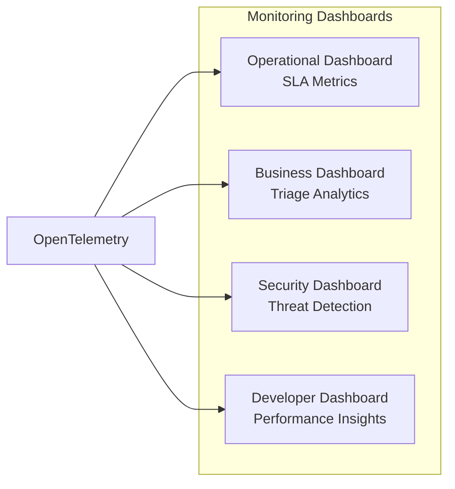
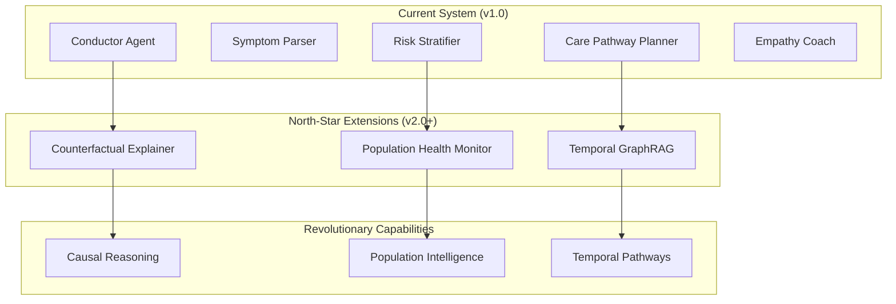

# Architecture Documentation

This document provides detailed architectural guidance for the Multi-Agent Medical Triage Conductor system.

## 🏗️ System Architecture

### High-Level Overview

The system follows a **multi-agent orchestration pattern** using Semantic Kernel to coordinate specialized AI agents that process clinical symptoms and provide triage recommendations.



### Core Principles

1. **Agent Specialization**: Each agent has a single, well-defined responsibility
2. **Loose Coupling**: Agents communicate through standardized interfaces
3. **Adapter Pattern**: All external dependencies use swappable adapters
4. **Contract-First**: All boundaries validated with Zod schemas
5. **Observability-First**: Full tracing and audit capabilities

## 🤖 Agent Architecture

### Agent Control Flow



### Agent Specifications

#### ConductorAgent
**Role**: Orchestrates the entire triage workflow
**Inputs**: Raw symptom text, patient mode (patient/clinician)
**Outputs**: Coordination signals, clarifying questions
**Key Logic**:
- Validates input completeness
- Routes to appropriate agents based on evidence quality
- Handles red-flag fast-path for urgent cases
- Manages clarification loops

#### SymptomParserAgent
**Role**: Extracts structured clinical data from free text
**Inputs**: Unstructured symptom descriptions
**Outputs**: ClinicalEvidence object with structured fields
**Key Logic**:
- NLP extraction of onset, severity, radiation, associations
- SNOMED code mapping for primary complaint
- Vital signs parsing when present
- Red-flag keyword detection

#### RiskStratifierAgent
**Role**: Computes risk level and urgency band
**Inputs**: ClinicalEvidence object
**Outputs**: RiskAssessment with band and probability
**Key Logic**:
- Deterministic red-flag rule application
- Weighted feature scoring (severity, vitals, associations)
- Bayesian probability estimation for urgent care
- NEWS-style vital sign modifiers

#### CarePathwayPlannerAgent
**Role**: Maps risk and symptoms to care recommendations
**Inputs**: ClinicalEvidence + RiskAssessment
**Outputs**: CarePlan with disposition and reasoning
**Key Logic**:
- Guideline lookup from seed data
- Disposition mapping (ED, urgent care, routine)
- Citation tracking for recommendations
- Safety-netting advice generation

#### EmpathyCoachAgent
**Role**: Adapts communication for target audience
**Inputs**: CarePlan + audience mode (patient/clinician)
**Outputs**: Audience-appropriate response
**Key Logic**:
- Language simplification for patients
- Medical terminology for clinicians
- Differential diagnosis filtering (clinician-only)
- Empathetic tone adjustment

## 🔧 Technical Architecture

### Next.js Application Structure

```
app/
├── (triage)/
│   ├── page.tsx              # Main triage interface
│   └── layout.tsx            # Triage-specific layout
├── api/
│   ├── triage/
│   │   └── route.ts          # POST /api/triage - main endpoint
│   ├── health/
│   │   └── route.ts          # GET /api/health - health check
│   └── embeddings/
│       └── route.ts          # POST /api/embeddings - dev only
└── layout.tsx                # Root layout with providers
```

### Component Architecture

```
components/
├── triage/
│   ├── SymptomInput.tsx      # Text input with suggestions
│   ├── RiskCard.tsx          # Risk level visualization
│   ├── PlanCard.tsx          # Care plan display
│   ├── RationaleDrawer.tsx   # Citations and audit trail
│   └── Timeline.tsx          # Patient history timeline
└── ui/                       # shadcn/ui components
    ├── button.tsx
    ├── card.tsx
    ├── drawer.tsx
    └── ...
```

### Data Layer Architecture

#### Adapter Pattern Implementation

```typescript
// FHIR Repository Interface
interface FhirRepository {
  getPatient(id: string): Promise<Patient>;
  createObservation(obs: Observation): Promise<string>;
  searchObservations(patientId: string): Promise<Observation[]>;
}

// Vector Store Interface  
interface VectorStore {
  upsert(id: string, text: string, embedding: number[]): Promise<void>;
  search(query: number[], limit: number): Promise<SearchResult[]>;
}

// LLM Provider Interface
interface LlmProvider {
  embed(texts: string[]): Promise<number[][]>;
  chat(messages: ChatMessage[], opts?: ChatOptions): Promise<string>;
}
```

#### Implementation Hierarchy



### Data Schema Architecture

#### Core Zod Schemas

```typescript
// Input/Output Contracts
export const ClinicalEvidence = z.object({
  patientId: z.string(),
  presentingComplaint: z.string(),
  features: z.object({
    onset: z.string().datetime(),
    severity: z.number().min(0).max(10).optional(),
    radiation: z.string().optional(),
    associated: z.array(z.string()).optional(),
    vitals: z.object({
      bp: z.string().optional(),
      hr: z.number().optional(),
      spo2: z.number().optional(),
      rr: z.number().optional(),
      temp: z.number().optional(),
    }).partial().optional(),
    redFlags: z.array(z.string()).optional(),
  }),
  codes: z.array(z.object({
    system: z.string(),
    code: z.string(), 
    term: z.string()
  })).optional(),
  meds: z.array(z.string()).optional(),
  allergies: z.array(z.string()).optional(),
});

export const RiskAssessment = z.object({
  band: z.enum(["immediate", "urgent", "routine"]),
  pUrgent: z.number().min(0).max(1),
  explain: z.array(z.string()),
  requiredInvestigations: z.array(z.string()).optional(),
  differentials: z.array(z.string()).optional(),
});

export const CarePlan = z.object({
  disposition: z.string(),
  why: z.array(z.string()),
  whatToExpect: z.array(z.string()).optional(),
  safetyNet: z.array(z.string()).optional(),
});
```

## 🔍 Observability Architecture

### OpenTelemetry Tracing



### Logging Strategy

```typescript
// Structured logging with PII redaction
logger.info('Triage request processed', {
  traceId,
  patientId: hash(patientId), // Hashed for privacy
  duration: endTime - startTime,
  riskBand: response.risk.band,
  disposition: response.plan.disposition,
  redFlags: response.risk.redFlags?.length || 0,
  // PII automatically redacted by logger middleware
});
```

## 🔒 Security Architecture

### Request/Response Validation



### Security Headers (Next.js Middleware)

```typescript
export function middleware(request: NextRequest) {
  const response = NextResponse.next();
  
  // OWASP Security Headers
  response.headers.set('X-Content-Type-Options', 'nosniff');
  response.headers.set('X-Frame-Options', 'SAMEORIGIN');
  response.headers.set('X-XSS-Protection', '1; mode=block');
  response.headers.set('Strict-Transport-Security', 'max-age=31536000');
  response.headers.set('Referrer-Policy', 'strict-origin-when-cross-origin');
  
  return response;
}
```

### Content Safety Pipeline

```typescript
// Multi-layer content filtering
const contentSafety = {
  input: [
    'profanityFilter',      // Basic profanity detection
    'medicalValidation',    // Medical context validation
    'injectionPrevention'   // SQL/prompt injection prevention
  ],
  output: [
    'harmReduction',        // Prevent harmful medical advice
    'confidenceThreshold',  // Require minimum confidence levels
    'citationRequired'      // Ensure all advice is cited
  ]
};
```

## ⚡ Performance Architecture

### Caching Strategy



### Performance Targets

| Metric | Target | Measurement |
|--------|---------|-------------|
| **API Response Time** | p95 < 900ms | k6 load testing |
| **First Contentful Paint** | < 1.2s | Lighthouse CI |
| **Time to Interactive** | < 2.5s | Playwright metrics |
| **Cumulative Layout Shift** | < 0.1 | Core Web Vitals |
| **Embedding Cache Hit Rate** | > 80% | Application metrics |

### Load Testing Architecture

```javascript
// k6 Performance Test Configuration
export let options = {
  stages: [
    { duration: '30s', target: 5 },   // Ramp up
    { duration: '60s', target: 10 },  // Sustained load
    { duration: '30s', target: 0 },   // Ramp down
  ],
  thresholds: {
    http_req_duration: ['p(95)<900'],  // 95% under 900ms
    http_req_failed: ['rate<0.1'],     // Error rate under 10%
  },
};
```

## 🧪 Testing Architecture

### Test Pyramid Strategy



### Test Data Management

```typescript
// Synthetic test data generation
const generateTestPatient = (): Patient => ({
  id: `patient-${faker.string.uuid()}`,
  name: faker.person.fullName(),
  birthDate: faker.date.birthdate(),
  // No real PII - all synthetic
});

const testScenarios = [
  {
    name: 'chest_pain_with_red_flags',
    input: 'Severe crushing chest pain for 20 minutes, sweating',
    expected: { riskBand: 'immediate', disposition: 'Emergency Department' }
  },
  // ... more scenarios
];
```

## 🚀 Deployment Architecture

### Local Development Mode

```yaml
# docker-compose.yml (optional HAPI FHIR)
version: '3.8'
services:
  hapi-fhir:
    image: hapiproject/hapi:latest
    ports:
      - "8080:8080"
    environment:
      - hapi.fhir.default_encoding=JSON
  
  postgres:
    image: postgres:14
    environment:
      - POSTGRES_DB=hapi
      - POSTGRES_USER=hapi
      - POSTGRES_PASSWORD=hapi
```

### Production Deployment (Future)



## 📊 Monitoring & Alerting

### Key Metrics

| Category | Metrics | Alerting Threshold |
|----------|---------|-------------------|
| **Performance** | Response time, throughput | p95 > 1s |
| **Reliability** | Error rate, uptime | Error rate > 5% |
| **Business** | Triage volume, risk distribution | Anomaly detection |
| **Security** | Failed auth, suspicious patterns | Real-time alerts |

### Dashboard Structure



This architecture supports the project's requirements for scalability, maintainability, and clinical safety while providing clear separation of concerns and comprehensive observability.

---

## 🚀 North-Star Extensions & Moonshot Features

### Revolutionary Future Vision

The Multi-Agent Medical Triage Conductor is designed to evolve beyond individual patient triage into a revolutionary healthcare intelligence platform. Three groundbreaking extensions will transform medical AI:



### 1. 🎯 Counterfactual Explainer Agent
> *"If GTN had been given earlier, predicted pain trajectory would be X."*

**Revolutionary Impact**: First AI system capable of real-time causal "what-if" analysis for medical interventions.

**Core Innovation**: 
- **Causal Inference Engine**: Pearl's three-step counterfactual algorithm applied to medical decisions
- **Treatment Timing Optimization**: Predict optimal intervention timing with confidence intervals
- **Medication Sequence Analysis**: Optimize drug interaction sequences for maximum effectiveness

**Technical Architecture**:
```typescript
interface CounterfactualScenario {
  factual: {interventions: MedicalIntervention[], outcome: MedicalOutcome};
  counterfactual: {interventions: MedicalIntervention[], predictedOutcome: MedicalOutcome};
  causalExplanation: CausalPathway[];
  confidence: number;
}
```

### 2. 🌍 Cross-Patient Early Warning System
> *"Cohort-level drift detection (e.g., ward-wide viral spike identification)"*

**Revolutionary Impact**: Population-level anomaly detection for outbreak prevention and health equity monitoring.

**Core Innovation**:
- **Statistical Drift Detection**: Real-time monitoring of symptom pattern changes across patient cohorts
- **Outbreak Prediction**: Identify viral spikes 24-48 hours before clinical recognition
- **Health Disparity Intelligence**: Demographic-specific health pattern analysis for equity improvements

**Technical Architecture**:
```typescript
interface PopulationHealthAnalysis {
  driftAnalysis: DriftMetric[];
  outbreakProbability: number;
  demographicDisparities: HealthDisparity[];
  environmentalCorrelations: EnvironmentalFactor[];
}
```

### 3. 🧬 Temporal GraphRAG System
> *"Build causal event graph (med → lab response) and retrieve subgraphs for similar patient trajectories"*

**Revolutionary Impact**: First graph-based medical reasoning system for trajectory analysis and causal pathway retrieval.

**Core Innovation**:
- **Causal Event Graphs**: Replace vector similarity with temporal causal pathway modeling
- **Trajectory-Based Retrieval**: Find patients with similar medical journeys, not just similar symptoms
- **Graph Neural Networks**: Advanced similarity measurement using medical pathway structures

**Technical Architecture**:
```typescript
interface TemporalMedicalGraph {
  nodes: {[id: string]: {type: MedicalEventType, timestamp: Date, value: any}};
  edges: {[id: string]: {relationship: CausalRelationType, strength: number}};
  causalPathways: CausalPathway[];
}
```

### Implementation Roadmap

#### Phase 1: Foundation (6 months)
- **Research Partnerships**: Stanford AI Lab, MIT CSAIL, Mayo Clinic, Johns Hopkins
- **Data Infrastructure**: Temporal event storage, causal graph database, population analytics
- **Proof of Concepts**: Basic counterfactual reasoning, drift detection algorithms, graph construction

#### Phase 2: Core Features (12 months)
- **Counterfactual Engine**: Full causal inference system for treatment optimization
- **Population Intelligence**: Real-time cohort monitoring and outbreak detection
- **Temporal GraphRAG**: Medical pathway similarity and retrieval system

#### Phase 3: Clinical Integration (18 months)
- **Hospital Validation**: Multi-site clinical trials for all three systems
- **Regulatory Approval**: FDA Software as Medical Device (SaMD) pathway
- **Performance Optimization**: Real-time processing for clinical deployment

#### Phase 4: Global Deployment (24 months)
- **Pandemic Preparedness**: Cross-institutional outbreak detection networks
- **Health Equity**: Population health disparities reduction programs
- **Research Platform**: Open-source medical AI research infrastructure

### Technical Innovation Areas

- **Causal Inference**: Pearl's causal hierarchy applied to medical decision-making
- **Population Analytics**: Federated learning for privacy-preserving population health intelligence  
- **Graph AI**: Temporal graph neural networks for medical pathway reasoning
- **Clinical Validation**: Rigorous prospective studies for regulatory approval

### Expected Impact

- **Clinical Outcomes**: 25% improvement in treatment effectiveness through optimized timing
- **Public Health**: Early outbreak detection preventing widespread disease transmission
- **Health Equity**: 20% reduction in health disparities through population monitoring
- **Research Acceleration**: 50+ new research papers enabled by open-source platform

### Ethical Framework

- **Privacy Protection**: Differential privacy and federated learning for population analytics
- **Clinical Safety**: Human oversight required for all predictive recommendations
- **Transparency**: Full explainability of causal reasoning and population health algorithms
- **Equity**: Continuous bias monitoring and disparity reduction focus

### Success Metrics

| Moonshot Feature | Success Metric | Target | Timeframe |
|------------------|----------------|---------|-----------|
| **Counterfactual Explainer** | Treatment optimization accuracy | 80% | 18 months |
| **Population Monitor** | Outbreak detection lead time | 24-48 hours | 12 months |
| **Temporal GraphRAG** | Pathway similarity precision | 85% | 24 months |

---

**Documentation References**:
- [North-Star Features Overview](docs/NORTH_STAR_FEATURES.md)
- [Counterfactual Reasoning Technical Specs](docs/COUNTERFACTUAL_REASONING.md)  
- [Population Health Intelligence](docs/POPULATION_HEALTH.md)
- [Temporal GraphRAG Architecture](docs/TEMPORAL_GRAPHRAG.md)

This moonshot vision positions the Multi-Agent Medical Triage Conductor as the foundational platform for the future of AI-powered healthcare, transforming from individual patient triage to comprehensive healthcare intelligence that protects populations, optimizes treatments, and advances medical research at unprecedented scale.