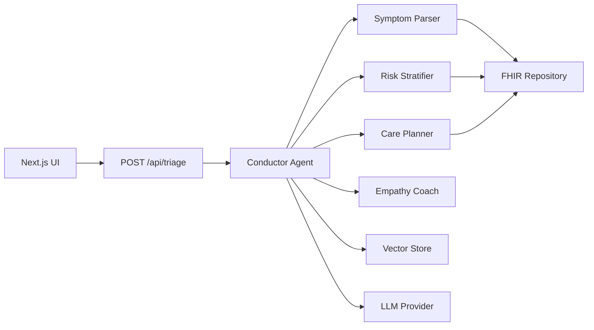

# Multi-Agent Medical Triage Conductor

A Next.js 14 application, based on semantic kernel supported in Azure AI Foundry.
that orchestrates multiple AI agents to perform clinical triage, providing risk 
assessment and care pathway recommendations for medical symptoms.

## 🚀 Quick Start

```bash
# Install dependencies
pnpm install

# Copy environment template
cp .env.example .env.local

# Add your API keys to .env.local
# OPENAI_API_KEY=your_key_here (or ANTHROPIC_API_KEY)

# Start development server
pnpm dev

# Open http://localhost:3000/triage
```

## 📋 Prerequisites

- Node.js 18+ and pnpm
- OpenAI or Anthropic API key
- Git

## 🏗️ Tech Stack

- **Frontend**: Next.js 14 (App Router), React Server Components, shadcn/ui, Tailwind CSS
- **Backend**: Next.js API Routes, Semantic Kernel (TypeScript)
- **Data**: SQLite (vector store), In-memory FHIR repository
- **Testing**: Vitest, Playwright, Pact, k6
- **AI/ML**: OpenAI/Anthropic APIs, embeddings for vector search

## 🎯 Features

### Core Functionality
- **Multi-agent triage workflow**: Coordinated AI agents for symptom processing
- **Risk stratification**: Automated red-flag detection and urgency scoring
- **Care pathway planning**: Evidence-based disposition recommendations
- **Dual-mode interface**: Patient-friendly vs clinical professional views
- **Citation tracking**: Full audit trail with guideline references

### Technical Features
- **Semantic Kernel orchestration**: TypeScript-based agent coordination
- **Vector similarity search**: Context-aware case retrieval
- **FHIR-compliant data models**: Healthcare interoperability standards
- **OpenTelemetry tracing**: Full observability and debugging
- **Comprehensive testing**: Unit, integration, e2e, contract, and performance tests

## 🏛️ Architecture



### Agent Responsibilities

| Agent | Purpose | Input | Output |
|-------|---------|-------|--------|
| **Conductor** | Orchestrates workflow, handles clarifications | Raw text | Coordination signals |
| **Symptom Parser** | Extracts structured clinical data | Free text | ClinicalEvidence object |
| **Risk Stratifier** | Applies red-flag rules, computes urgency | Clinical evidence | RiskAssessment object |
| **Care Planner** | Maps to care pathways with citations | Risk + evidence | CarePlan object |
| **Empathy Coach** | Adapts language for audience | Plan + mode | Patient/clinician response |

## 🚦 Development Workflow

### Feature Development Rules

1. **Test-driven**: Write failing tests before implementation
2. **Gated progression**: ALL tests must pass before next feature
3. **Contract-first**: Use Zod schemas for all API boundaries
4. **Performance conscious**: Maintain p95 < 900ms response times

### Testing Pipeline (Must run in order)

```bash
pnpm lint         # ESLint + Prettier
pnpm typecheck    # TypeScript validation
pnpm test         # Unit tests (Vitest)
pnpm contract     # Contract tests (Pact)
pnpm e2e          # E2E tests (Playwright)
pnpm perf         # Performance tests (k6)
```

## 📁 Project Structure

```
triage-conductor/
├── app/
│   ├── (triage)/page.tsx          # Main triage interface
│   └── api/
│       ├── triage/route.ts        # Main orchestration endpoint
│       └── health/route.ts        # Health check
├── components/triage/             # UI components
│   ├── SymptomInput.tsx           # Text input with suggestions
│   ├── RiskCard.tsx               # Risk level display
│   ├── PlanCard.tsx               # Care recommendations
│   └── RationaleDrawer.tsx        # Citations and audit trail
├── lib/
│   ├── schemas.ts                 # Zod validation schemas
│   ├── adapters/                  # Provider interfaces
│   │   ├── fhir/                  # FHIR repository adapters
│   │   ├── vector/                # Vector store adapters  
│   │   └── llm/                   # LLM provider adapters
│   └── sk/                        # Semantic Kernel setup
│       ├── agents/                # AI agent implementations
│       └── prompts/               # Prompt templates
├── data/seed/                     # Synthetic test data
└── tests/                         # Test suites by type
```

## 🔧 Environment Configuration

Create `.env.local` with:

```bash
# Application mode
APP_MODE=LOCAL                     # LOCAL or CLOUD

# AI Provider (choose one)
MODEL_PROVIDER=openai              # openai | anthropic | azure
OPENAI_API_KEY=sk-...              # OpenAI API key
ANTHROPIC_API_KEY=sk-ant-...       # Anthropic API key

# Model configuration
LLM_MODEL=gpt-4o-mini             # or claude-3-5-sonnet-20240620
EMBEDDINGS_MODEL=text-embedding-3-small

# Data storage
VECTOR_DB_PATH=.data/triage.sqlite

# Logging
LOG_LEVEL=info
```

## 🧪 Testing Strategy

### Test Types & Coverage

| Test Type | Tool | Purpose | Coverage |
|-----------|------|---------|----------|
| **Unit** | Vitest | Individual functions | Agent logic, utilities |
| **Integration** | Vitest | API routes | End-to-end request flows |
| **Contract** | Pact | API boundaries | Consumer-provider contracts |
| **E2E** | Playwright | User workflows | Complete triage scenarios |
| **Performance** | k6 | Load testing | Response time SLAs |
| **Accessibility** | Axe | A11y compliance | WCAG 2.1 AA standards |

### Sample Test Commands

```bash
# Run specific test suites
pnpm test src/lib/agents/          # Test specific directory
pnpm test --ui                     # Visual test interface
pnpm e2e --headed                  # Run e2e with browser visible
pnpm perf -- --vus 5 --duration 30s # Custom load test
```

## 🔒 Security & Compliance

- **Data Privacy**: Synthetic data only, PII redaction in logs
- **Input Validation**: Zod schemas on all API boundaries  
- **Security Headers**: OWASP-compliant via Next.js middleware
- **Content Safety**: Basic filtering on LLM interactions
- **Audit Trails**: OpenTelemetry tracing for all operations

## 🚀 Deployment

### Local Development
```bash
pnpm dev     # Development server with hot reload
pnpm build   # Production build
pnpm start   # Production server
```

### Production Checklist
- [ ] Environment variables configured
- [ ] All tests passing (`pnpm ci`)
- [ ] Security headers enabled
- [ ] Monitoring/observability configured
- [ ] Performance benchmarks met

## 🤝 Contributing

1. **Fork & clone** the repository
2. **Create feature branch**: `git checkout -b feature/symptom-voice-input`
3. **Write tests first** for new functionality
4. **Implement feature** following existing patterns
5. **Run full CI**: `pnpm ci` must pass
6. **Submit PR** with clear description

### Code Style
- TypeScript strict mode enabled
- ESLint + Prettier for formatting
- Conventional commits preferred
- No console.log in production code

## 🎯 Roadmap

### Current Features (MVP - v1.0) ✅
- [x] Text-based symptom input with AI-generated medical logic
- [x] Multi-agent triage workflow using Semantic Kernel
- [x] Risk stratification with automated red flag detection  
- [x] Evidence-based care pathway recommendations
- [x] Patient/clinician dual communication modes
- [x] Cost-optimized dual provider support (OpenAI/Anthropic)
- [x] Memory Augmented RAG with Azure AI Search integration
- [x] Comprehensive testing framework (unit, integration, e2e, contract, performance)

### Near-term Features (v1.x)
- [ ] Voice input integration with medical transcription
- [ ] Docker HAPI FHIR support for clinical data standards
- [ ] Multi-language support for global deployment
- [ ] Advanced clinical decision support with citations
- [ ] Real-time collaboration features for care teams

### 🚀 North-Star Extensions - Revolutionary Moonshot Features (v2.0+)

The Multi-Agent Medical Triage Conductor is designed to evolve into a revolutionary healthcare intelligence platform with three groundbreaking capabilities:

#### 1. 🎯 **Counterfactual Explainer Agent**
> *"If GTN had been given earlier, predicted pain trajectory would be X."*

**Revolutionary Impact**: First AI system for real-time causal "what-if" analysis in medical decisions.

- **Causal Inference Engine**: Pearl's three-step counterfactual algorithm for treatment optimization  
- **Treatment Timing Analysis**: Predict optimal intervention timing with confidence intervals
- **Medication Sequence Optimization**: Analyze drug interaction sequences for maximum effectiveness
- **Clinical Decision Support**: "What would happen if..." analysis for treatment planning

#### 2. 🌍 **Cross-Patient Early Warning System** 
> *"Cohort-level drift detection (e.g., ward-wide viral spike identification)"*

**Revolutionary Impact**: Population-level anomaly detection for outbreak prevention and health equity.

- **Statistical Drift Detection**: Real-time monitoring of symptom patterns across patient cohorts
- **Outbreak Prediction**: Identify viral spikes 24-48 hours before clinical recognition  
- **Health Disparity Intelligence**: Demographic-specific health pattern analysis
- **Environmental Correlation Analysis**: Air quality, pollen, weather impact on population health

#### 3. 🧬 **Temporal GraphRAG System**
> *"Build causal event graph (med → lab response) and retrieve subgraphs for similar patient trajectories"*

**Revolutionary Impact**: First graph-based medical reasoning system for causal pathway analysis.

- **Causal Event Graphs**: Replace vector similarity with temporal medical pathway modeling
- **Trajectory-Based Retrieval**: Find patients with similar medical journeys, not just symptoms
- **Graph Neural Networks**: Advanced pathway similarity using medical event sequences  
- **Subgraph Pattern Recognition**: Identify recurring causal patterns across patient populations

### 🗓️ **Moonshot Implementation Timeline**

| Phase | Duration | Key Deliverables | Research Partners |
|-------|----------|------------------|------------------|
| **Phase 1: Foundation** | 6 months | Data infrastructure, proof of concepts | Stanford AI Lab, MIT CSAIL |
| **Phase 2: Core Features** | 12 months | Full counterfactual engine, population monitoring | Mayo Clinic, Johns Hopkins |
| **Phase 3: Clinical Integration** | 18 months | Hospital validation, regulatory approval | Mass General, FDA |
| **Phase 4: Global Deployment** | 24 months | Multi-institutional networks, open platform | WHO, International Partners |

### 🎯 **Expected Transformational Impact**

- **Clinical Outcomes**: 25% improvement in treatment effectiveness through optimized timing
- **Public Health**: Early outbreak detection preventing widespread disease transmission  
- **Health Equity**: 20% reduction in health disparities through population monitoring
- **Research Acceleration**: 50+ new medical AI research papers enabled by open-source platform

### 📚 **Moonshot Documentation**

Detailed technical specifications available:
- 🌟 [North-Star Features Overview](docs/NORTH_STAR_FEATURES.md)
- 🎯 [Counterfactual Reasoning Architecture](docs/COUNTERFACTUAL_REASONING.md)
- 🌍 [Population Health Intelligence](docs/POPULATION_HEALTH.md) 
- 🧬 [Temporal GraphRAG System](docs/TEMPORAL_GRAPHRAG.md)

---

**This moonshot vision positions the project as the foundational platform for the future of AI-powered healthcare - transforming from individual patient triage to comprehensive healthcare intelligence that protects populations, optimizes treatments, and advances medical research at unprecedented scale.**

## 📚 Documentation

- **[CLAUDE.md](./CLAUDE.md)**: Claude Code development guidelines
- **[ARCHITECTURE.md](./ARCHITECTURE.md)**: Detailed system design
- **[TESTING.md](./TESTING.md)**: Testing strategies and patterns

## 📞 Support

For questions or issues:
1. Check existing GitHub Issues
2. Review documentation in `/docs`
3. Create new issue with reproduction steps

## 📄 License

MIT License - see [LICENSE](./LICENSE) for details
