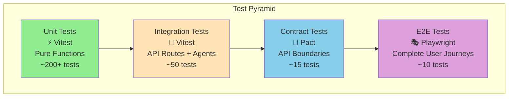

# Testing Strategy & Guidelines

This document outlines the comprehensive testing approach for the Multi-Agent Medical Triage Conductor system.

## 🎯 Testing Philosophy

### Core Principles

1. **Test-Driven Development**: Write failing tests before implementation
2. **Gated Feature Development**: ALL test types must pass before proceeding to next feature
3. **Contract-First Testing**: API boundaries validated with Pact consumer contracts
4. **Performance-Conscious**: Every feature validated against performance SLAs
5. **Healthcare-Grade Quality**: Medical software requires exceptional reliability

### Test Pyramid Strategy



## 🏗️ Test Architecture

### Test Directory Structure

```
tests/
├── unit/
│   ├── agents/
│   │   ├── SymptomParser.test.ts
│   │   ├── RiskStratifier.test.ts
│   │   ├── CarePathwayPlanner.test.ts
│   │   └── EmpathyCoach.test.ts
│   ├── adapters/
│   │   ├── LocalFhirRepo.test.ts
│   │   ├── SqliteVectorStore.test.ts
│   │   └── OpenAIProvider.test.ts
│   └── utils/
│       ├── schemas.test.ts
│       └── logger.test.ts
├── integration/
│   ├── api/
│   │   ├── triage.test.ts
│   │   ├── health.test.ts
│   │   └── embeddings.test.ts
│   └── agents/
│       └── full-workflow.test.ts
├── contract/
│   ├── pact/
│   │   ├── triage-api.pact.ts
│   │   └── embeddings-api.pact.ts
│   └── setup/
│       └── pact-setup.ts
├── e2e/
│   ├── playwright/
│   │   ├── triage-workflow.spec.ts
│   │   ├── accessibility.spec.ts
│   │   └── performance.spec.ts
│   └── fixtures/
│       └── test-scenarios.ts
├── perf/
│   ├── k6/
│   │   ├── triage-smoke.js
│   │   ├── triage-load.js
│   │   └── triage-stress.js
│   └── reports/
└── shared/
    ├── fixtures/
    │   ├── patients.json
    │   ├── symptoms.json
    │   └── expected-outputs.json
    └── helpers/
        ├── test-data.ts
        └── assertions.ts
```

## 🧪 Test Implementation Guide

### Unit Tests (Vitest)

#### Agent Testing Pattern

```typescript
// tests/unit/agents/SymptomParser.test.ts
import { describe, it, expect, beforeEach } from 'vitest';
import { SymptomParserAgent } from '@/lib/sk/agents/SymptomParserAgent';
import { testKernel } from '../helpers/test-kernel';

describe('SymptomParserAgent', () => {
  let agent: SymptomParserAgent;
  
  beforeEach(() => {
    agent = new SymptomParserAgent(testKernel);
  });

  describe('symptom extraction', () => {
    it('should extract severity from numeric input', async () => {
      const input = "Severe chest pain 8/10 for 2 hours";
      const result = await agent.parse(input);
      
      expect(result.features.severity).toBe(8);
      expect(result.features.onset).toContain('2 hours');
      expect(result.presentingComplaint).toContain('chest pain');
    });

    it('should identify red flags correctly', async () => {
      const input = "Crushing chest pain with sweating and nausea";
      const result = await agent.parse(input);
      
      expect(result.features.redFlags).toContain('crushing chest pain');
      expect(result.features.associated).toContain('diaphoresis');
    });
  });

  describe('SNOMED mapping', () => {
    it('should map chest pain to appropriate SNOMED code', async () => {
      const input = "Chest pain";
      const result = await agent.parse(input);
      
      expect(result.codes).toContainEqual({
        system: 'SNOMED-CT',
        code: '29857009',
        term: 'Chest pain'
      });
    });
  });
});
```

#### Adapter Testing Pattern

```typescript
// tests/unit/adapters/LocalFhirRepo.test.ts
describe('LocalFhirRepo', () => {
  let repo: LocalFhirRepo;
  
  beforeEach(() => {
    repo = new LocalFhirRepo();
    repo.seed(testPatients); // Load synthetic data
  });

  it('should create and retrieve observations', async () => {
    const observation = createTestObservation();
    const id = await repo.createObservation(observation);
    const retrieved = await repo.getObservation(id);
    
    expect(retrieved).toEqual(observation);
  });

  it('should search observations by patient', async () => {
    const patientId = 'patient-123';
    const results = await repo.searchObservations(patientId);
    
    expect(results).toHaveLength(2);
    expect(results.every(obs => obs.subject.reference.includes(patientId))).toBe(true);
  });
});
```

### Integration Tests (Vitest)

#### API Route Testing

```typescript
// tests/integration/api/triage.test.ts
import { createMocks } from 'node-mocks-http';
import { POST } from '@/app/api/triage/route';
import { TriageRequest } from '@/lib/schemas';

describe('/api/triage', () => {
  it('should process complete triage workflow', async () => {
    const request = createMocks({
      method: 'POST',
      body: {
        mode: 'clinician',
        input: { text: 'Patient reports severe chest pain for 30 minutes' },
        patientId: 'patient-test-001'
      }
    });

    const response = await POST(request.req);
    const data = await response.json();

    expect(response.status).toBe(200);
    expect(data).toMatchObject({
      evidence: expect.objectContaining({
        presentingComplaint: expect.stringContaining('chest pain'),
      }),
      risk: expect.objectContaining({
        band: expect.stringMatching(/immediate|urgent|routine/),
        pUrgent: expect.any(Number),
      }),
      plan: expect.objectContaining({
        disposition: expect.any(String),
        why: expect.any(Array),
      }),
    });
  });

  it('should handle red flag scenarios correctly', async () => {
    const redFlagInput = {
      mode: 'clinician' as const,
      input: { text: 'Crushing chest pain, diaphoretic, nauseous' },
      patientId: 'patient-red-flag-001'
    };

    const request = createMocks({
      method: 'POST',
      body: redFlagInput
    });

    const response = await POST(request.req);
    const data = await response.json();

    expect(data.risk.band).toBe('immediate');
    expect(data.plan.disposition).toContain('Emergency Department');
  });
});
```

### Contract Tests (Pact)

#### Consumer Contract Testing

```typescript
// tests/contract/pact/triage-api.pact.ts
import { PactV3, MatchersV3 } from '@pact-foundation/pact';
const { like, eachLike, term } = MatchersV3;

describe('Triage API Consumer Contract', () => {
  const provider = new PactV3({
    consumer: 'triage-ui',
    provider: 'triage-api',
    port: 1234,
  });

  it('should receive valid triage response for symptom input', async () => {
    await provider
      .given('patient exists with id patient-123')
      .uponReceiving('a triage request with chest pain')
      .withRequest({
        method: 'POST',
        path: '/api/triage',
        headers: { 'Content-Type': 'application/json' },
        body: {
          mode: 'clinician',
          input: { text: 'chest pain' },
          patientId: 'patient-123'
        }
      })
      .willRespondWith({
        status: 200,
        headers: { 'Content-Type': 'application/json' },
        body: {
          evidence: {
            patientId: 'patient-123',
            presentingComplaint: like('chest pain'),
            features: {
              onset: like('2024-01-01T10:00:00Z'),
              severity: like(7),
              redFlags: eachLike('crushing chest pain')
            }
          },
          risk: {
            band: term({ matcher: 'immediate|urgent|routine', generate: 'urgent' }),
            pUrgent: like(0.8),
            explain: eachLike('Chest pain requires urgent assessment')
          },
          plan: {
            disposition: like('Emergency Department'),
            why: eachLike('Potential cardiac event'),
            safetyNet: eachLike('Return if symptoms worsen')
          },
          confidence: like(0.9),
          citations: eachLike({
            source: like('guidelines.json#chest_pain_1'),
            snippet: like('Chest pain with red flags requires immediate assessment')
          })
        }
      })
      .executeTest(async (mockServer) => {
        // Test implementation using fetch to mockServer.url
        const response = await fetch(`${mockServer.url}/api/triage`, {
          method: 'POST',
          headers: { 'Content-Type': 'application/json' },
          body: JSON.stringify({
            mode: 'clinician',
            input: { text: 'chest pain' },
            patientId: 'patient-123'
          })
        });
        
        expect(response.status).toBe(200);
        const data = await response.json();
        expect(data.risk.band).toMatch(/immediate|urgent|routine/);
      });
  });
});
```

### E2E Tests (Playwright)

#### User Journey Testing

```typescript
// tests/e2e/playwright/triage-workflow.spec.ts
import { test, expect } from '@playwright/test';
import { triageScenarios } from '../fixtures/test-scenarios';

test.describe('Triage Workflow', () => {
  test('should complete full triage for chest pain scenario', async ({ page }) => {
    await page.goto('/triage');
    
    // Input symptoms
    await page.fill('[data-testid=symptom-input]', 'Severe chest pain for 20 minutes');
    await page.click('[data-testid=submit-button]');
    
    // Wait for processing
    await page.waitForSelector('[data-testid=risk-card]');
    
    // Verify risk assessment
    const riskBand = await page.textContent('[data-testid=risk-band]');
    expect(['immediate', 'urgent', 'routine']).toContain(riskBand?.toLowerCase());
    
    // Verify care plan
    await expect(page.locator('[data-testid=care-plan]')).toBeVisible();
    await expect(page.locator('[data-testid=disposition]')).toContainText(/Emergency|Urgent|Routine/);
    
    // Check citations are available
    await page.click('[data-testid=rationale-button]');
    await expect(page.locator('[data-testid=citations]')).toBeVisible();
  });

  test('should handle patient vs clinician modes differently', async ({ page }) => {
    await page.goto('/triage');
    
    // Test patient mode
    await page.click('[data-testid=patient-mode]');
    await page.fill('[data-testid=symptom-input]', 'I have chest pain');
    await page.click('[data-testid=submit-button]');
    
    await page.waitForSelector('[data-testid=care-plan]');
    const patientPlan = await page.textContent('[data-testid=care-plan]');
    
    // Should use simple language, no differentials
    expect(patientPlan).not.toContain('differential diagnosis');
    expect(patientPlan).not.toContain('myocardial infarction');
  });
});
```

#### Accessibility Testing

```typescript
// tests/e2e/playwright/accessibility.spec.ts
import { test, expect } from '@playwright/test';
import AxeBuilder from '@axe-core/playwright';

test.describe('Accessibility Compliance', () => {
  test('should pass axe accessibility tests', async ({ page }) => {
    await page.goto('/triage');
    
    const accessibilityScanResults = await new AxeBuilder({ page }).analyze();
    expect(accessibilityScanResults.violations).toEqual([]);
  });

  test('should support keyboard navigation', async ({ page }) => {
    await page.goto('/triage');
    
    // Tab through form elements
    await page.keyboard.press('Tab'); // Focus symptom input
    await page.keyboard.type('chest pain');
    
    await page.keyboard.press('Tab'); // Focus submit button
    await page.keyboard.press('Enter'); // Submit form
    
    await page.waitForSelector('[data-testid=risk-card]');
    expect(await page.locator('[data-testid=risk-card]')).toBeVisible();
  });
});
```

### Performance Tests (k6)

#### Load Testing Scripts

```javascript
// tests/perf/k6/triage-load.js
import http from 'k6/http';
import { check, sleep } from 'k6';
import { Rate } from 'k6/metrics';

const errorRate = new Rate('errors');

export let options = {
  stages: [
    { duration: '30s', target: 5 },   // Ramp up to 5 users
    { duration: '60s', target: 10 },  // Stay at 10 users for 1 minute
    { duration: '30s', target: 0 },   // Ramp down to 0 users
  ],
  thresholds: {
    http_req_duration: ['p(95)<900'],     // 95% of requests under 900ms
    http_req_failed: ['rate<0.1'],        // Error rate under 10%
    errors: ['rate<0.1'],                 // Custom error rate under 10%
  },
};

const scenarios = [
  {
    input: "Severe chest pain for 20 minutes, sweating",
    expectedRisk: "immediate"
  },
  {
    input: "Mild headache this morning", 
    expectedRisk: "routine"
  },
  {
    input: "Shortness of breath after climbing stairs",
    expectedRisk: "urgent"
  }
];

export default function () {
  const scenario = scenarios[Math.floor(Math.random() * scenarios.length)];
  
  const payload = JSON.stringify({
    mode: 'clinician',
    input: { text: scenario.input },
    patientId: `perf-test-${__VU}-${__ITER}`
  });

  const params = {
    headers: {
      'Content-Type': 'application/json',
    },
  };

  const response = http.post('http://localhost:3000/api/triage', payload, params);
  
  const success = check(response, {
    'status is 200': (r) => r.status === 200,
    'response time < 900ms': (r) => r.timings.duration < 900,
    'has evidence': (r) => JSON.parse(r.body).evidence !== undefined,
    'has risk assessment': (r) => JSON.parse(r.body).risk !== undefined,
    'has care plan': (r) => JSON.parse(r.body).plan !== undefined,
  });

  errorRate.add(!success);
  sleep(1);
}
```

## 🎮 Test Execution Strategy

### CI/CD Pipeline Testing

```mermaid
graph LR
    A[Code Push] --> B[Lint & TypeCheck]
    B --> C[Unit Tests]
    C --> D[Integration Tests]
    D --> E[Contract Tests]
    E --> F[Build Application]
    F --> G[E2E Tests]
    G --> H[Performance Tests]
    H --> I[Deploy to Staging]
    I --> J[Smoke Tests]
    J --> K[Deploy to Production]
    
    style A fill:#90EE90
    style K fill:#90EE90
    style B fill:#FFE4B5
    style C fill:#FFE4B5
    style D fill:#FFE4B5
    style E fill:#FFE4B5
    style F fill:#87CEEB
    style G fill:#87CEEB
    style H fill:#DDA0DD
    style I fill:#DDA0DD
    style J fill:#DDA0DD
```



### Test Command Execution Order

```bash
# Development workflow
pnpm test:watch          # Unit tests in watch mode during development

# Pre-commit checks
pnpm lint                # ESLint + Prettier
pnpm typecheck          # TypeScript validation

# Full CI pipeline (must pass in order)
pnpm test               # Unit tests
pnpm test:integration   # Integration tests  
pnpm contract           # Contract tests (Pact)
pnpm build              # Build verification
pnpm e2e                # E2E tests (requires built app)
pnpm perf               # Performance smoke tests

# Quick pipeline check
pnpm ci                 # Runs all of the above in sequence
```

## 📊 Test Coverage & Quality Metrics

### Coverage Targets

| Test Type | Target Coverage | Quality Gates |
|-----------|----------------|---------------|
| **Unit Tests** | 90%+ line coverage | Critical paths 100% |
| **Integration** | 80%+ API routes | All endpoints covered |
| **E2E** | 100% user journeys | Happy + error paths |
| **Performance** | 100% critical APIs | SLA compliance |

### Quality Gates

```typescript
// vitest.config.ts
export default defineConfig({
  test: {
    coverage: {
      provider: 'v8',
      reporter: ['text', 'json', 'html'],
      thresholds: {
        lines: 90,
        functions: 85,
        branches: 80,
        statements: 90
      },
      exclude: [
        'tests/**',
        '*.config.ts',
        '.next/**'
      ]
    }
  }
});
```

### Test Data Management

#### Synthetic Data Generation

```typescript
// tests/shared/helpers/test-data.ts
import { faker } from '@faker-js/faker';

export const createTestPatient = (overrides = {}) => ({
  id: faker.string.uuid(),
  name: faker.person.fullName(),
  birthDate: faker.date.birthdate({ min: 18, max: 90, mode: 'age' }),
  gender: faker.helpers.arrayElement(['male', 'female', 'other']),
  ...overrides
});

export const createSymptomScenario = (type: 'chest_pain' | 'headache' | 'shortness_of_breath') => {
  const scenarios = {
    chest_pain: {
      text: 'Severe crushing chest pain for 20 minutes with sweating',
      expectedRisk: 'immediate',
      expectedDisposition: 'Emergency Department'
    },
    headache: {
      text: 'Mild headache this morning, feels like tension',
      expectedRisk: 'routine', 
      expectedDisposition: 'Primary Care'
    },
    shortness_of_breath: {
      text: 'Increasing shortness of breath over 2 days',
      expectedRisk: 'urgent',
      expectedDisposition: 'Urgent Care'
    }
  };
  return scenarios[type];
};
```

## 🔍 Test Debugging & Troubleshooting

### Test Environment Setup

```typescript
// tests/setup/test-env.ts
import { beforeAll, afterAll, beforeEach, afterEach } from 'vitest';
import { setupTestDatabase } from './test-database';
import { mockLLMProvider } from './mock-providers';

beforeAll(async () => {
  // Setup test database with synthetic data
  await setupTestDatabase();
  
  // Mock external services
  mockLLMProvider();
  
  // Set test environment variables
  process.env.NODE_ENV = 'test';
  process.env.MODEL_PROVIDER = 'mock';
});

afterAll(async () => {
  // Cleanup test resources
  await cleanupTestDatabase();
});

beforeEach(() => {
  // Reset mocks between tests
  vi.clearAllMocks();
});
```

### Debugging Failed Tests

```typescript
// Custom test assertions with detailed error messages
expect.extend({
  toMatchTriageResponse(received, expected) {
    const pass = 
      received.evidence?.presentingComplaint?.includes(expected.complaint) &&
      received.risk?.band === expected.riskBand &&
      received.plan?.disposition?.includes(expected.disposition);

    return {
      message: () => 
        `Triage response mismatch:\n` +
        `Expected: ${JSON.stringify(expected, null, 2)}\n` +
        `Received: ${JSON.stringify(received, null, 2)}`,
      pass
    };
  }
});
```

This comprehensive testing strategy ensures medical-grade software quality with full traceability, performance validation, and accessibility compliance.