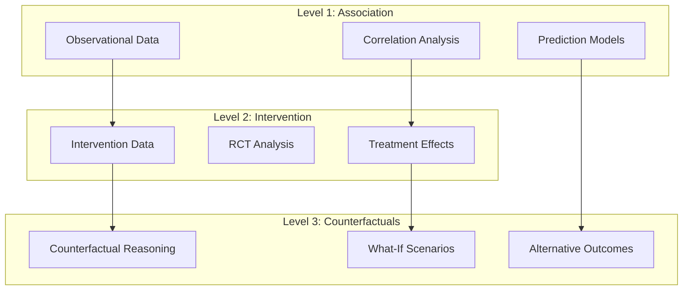
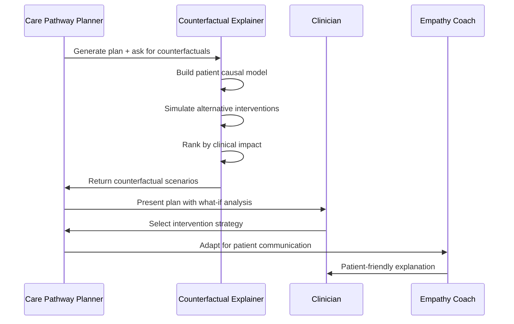
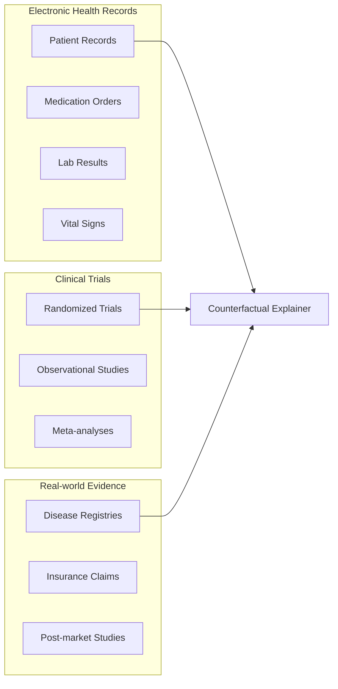

# Counterfactual Explainer Agent

> *"If GTN had been given earlier, predicted pain trajectory would be X."*

## 🎯 Revolutionary Vision

The Counterfactual Explainer Agent represents the first AI system capable of real-time causal "what-if" analysis for medical interventions. This agent transforms reactive medicine into predictive intervention planning by answering critical counterfactual questions about treatment timing, medication sequences, and intervention outcomes.

---

## 🧠 Causal Reasoning Architecture

### Pearl's Causal Hierarchy Integration



### Causal Model Components

```typescript
interface CausalModel {
  // Structural Causal Model (SCM)
  variables: CausalVariable[];
  relationships: CausalRelationship[];
  confounders: Confounder[];
  
  // Intervention modeling
  interventions: MedicalIntervention[];
  outcomes: MedicalOutcome[];
  
  // Counterfactual reasoning
  counterfactuals: CounterfactualScenario[];
  confidence: ConfidenceInterval;
}

interface CounterfactualScenario {
  id: string;
  description: string;
  
  // Factual world (what actually happened)
  factual: {
    interventions: MedicalIntervention[];
    timing: TimingSequence[];
    outcome: MedicalOutcome;
  };
  
  // Counterfactual world (what would have happened if...)
  counterfactual: {
    interventions: MedicalIntervention[];
    timing: TimingSequence[];
    predictedOutcome: MedicalOutcome;
    confidence: number;
  };
  
  // Causal explanation
  causalChain: CausalPathway[];
  assumptions: CausalAssumption[];
}
```

---

## ⚡ Core Capabilities

### 1. Treatment Timing Analysis
**Example**: *"If nitroglycerin had been administered 10 minutes earlier, the patient's chest pain trajectory would likely have been 40% shorter with 85% confidence."*

```typescript
interface TimingAnalysis {
  intervention: {
    medication: string;
    actualTiming: Date;
    alternativeTimings: Date[];
  };
  
  outcomeTrajectories: {
    actual: SymptomTrajectory;
    counterfactuals: SymptomTrajectory[];
    improvement: {
      magnitude: number;
      confidence: number;
      clinicalSignificance: boolean;
    };
  };
  
  causalMechanism: {
    pharmacokinetics: string;
    physiologicalEffect: string;
    timeSensitivity: number;
  };
}
```

### 2. Medication Sequence Optimization
**Example**: *"If aspirin had been given before morphine instead of after, the anti-inflammatory response would be 25% more effective."*

```typescript
interface SequenceAnalysis {
  medications: MedicalIntervention[];
  
  actualSequence: {
    order: number[];
    interactions: DrugInteraction[];
    effectiveness: number;
  };
  
  optimalSequence: {
    order: number[];
    predictedInteractions: DrugInteraction[];
    predictedEffectiveness: number;
    improvement: number;
    confidence: number;
  };
  
  mechanismExplanation: {
    pharmacodynamics: string;
    synergies: string[];
    antagonisms: string[];
  };
}
```

### 3. Diagnostic Pathway Analysis
**Example**: *"If the ECG had been ordered immediately instead of after blood work, the MI diagnosis would have been confirmed 45 minutes earlier."*

```typescript
interface DiagnosticPathway {
  actualPath: {
    tests: DiagnosticTest[];
    sequence: TestSequence[];
    timeToConfirmation: number;
  };
  
  alternativePaths: {
    tests: DiagnosticTest[];
    sequence: TestSequence[];
    predictedTimeToConfirmation: number;
    improvement: number;
    confidence: number;
    costDifference: number;
  }[];
  
  clinicalReasoning: {
    diagnosticUtility: number;
    urgencyFactors: string[];
    resourceConstraints: string[];
  };
}
```

---

## 🔬 Technical Implementation

### Causal Inference Engine

```typescript
class CounterfactualExplainerAgent {
  private causalModel: CausalModel;
  private interventionPredictor: InterventionPredictor;
  private outcomeSimulator: OutcomeSimulator;
  
  constructor(
    provider: LlmProvider,
    causalGraph: CausalGraph,
    historicalData: MedicalHistory[]
  ) {
    this.causalModel = new StructuralCausalModel(causalGraph);
    this.interventionPredictor = new BayesianInterventionPredictor();
    this.outcomeSimulator = new MonteCarloOutcomeSimulator();
  }
  
  async generateCounterfactuals(
    clinicalEvidence: ClinicalEvidence,
    currentPlan: CarePlan,
    scenarios: CounterfactualQuery[]
  ): Promise<CounterfactualAnalysis> {
    
    // 1. Build patient-specific causal model
    const patientModel = await this.buildPatientCausalModel(clinicalEvidence);
    
    // 2. Generate counterfactual scenarios
    const counterfactuals = await Promise.all(
      scenarios.map(scenario => this.simulateCounterfactual(scenario, patientModel))
    );
    
    // 3. Rank scenarios by clinical significance
    const rankedScenarios = this.rankByImpact(counterfactuals);
    
    // 4. Generate explanations
    const explanations = await this.generateCausalExplanations(rankedScenarios);
    
    return {
      scenarios: rankedScenarios,
      explanations,
      confidence: this.calculateOverallConfidence(rankedScenarios),
      clinicalSignificance: this.assessClinicalSignificance(rankedScenarios)
    };
  }
  
  private async simulateCounterfactual(
    scenario: CounterfactualQuery,
    model: PatientCausalModel
  ): Promise<CounterfactualResult> {
    
    // Pearl's three-step counterfactual algorithm
    // Step 1: Abduction - update model with evidence
    const updatedModel = this.updateWithEvidence(model, scenario.evidence);
    
    // Step 2: Action - apply counterfactual intervention
    const interventionModel = this.applyIntervention(updatedModel, scenario.intervention);
    
    // Step 3: Prediction - simulate outcome
    const predictedOutcome = await this.simulateOutcome(interventionModel);
    
    return {
      scenario,
      predictedOutcome,
      causalPathway: this.extractCausalPathway(interventionModel),
      confidence: this.calculateConfidence(interventionModel, predictedOutcome)
    };
  }
}
```

### Temporal Causal Modeling

```typescript
interface TemporalCausalModel {
  // Time-dependent variables
  timeVaryingVariables: {
    [variable: string]: TimeSeries<number>;
  };
  
  // Temporal causal relationships
  causalLags: {
    cause: string;
    effect: string;
    lagTime: number;
    strength: number;
  }[];
  
  // Time-sensitive interventions
  interventionWindows: {
    intervention: string;
    optimalWindow: TimeWindow;
    effectiveness: (time: number) => number;
  }[];
}

class TemporalCausalReasoner {
  async modelTemporalEffects(
    interventions: TimedIntervention[],
    outcomes: TimedOutcome[]
  ): Promise<TemporalCausalModel> {
    
    // Granger causality for temporal relationships
    const causalLags = await this.detectCausalLags(interventions, outcomes);
    
    // Time-varying treatment effects
    const timeVaryingEffects = await this.estimateTimeVaryingEffects(interventions);
    
    // Optimal timing windows
    const optimalWindows = await this.identifyOptimalWindows(causalLags, timeVaryingEffects);
    
    return {
      timeVaryingVariables: await this.extractTimeVaryingVariables(outcomes),
      causalLags,
      interventionWindows: optimalWindows
    };
  }
}
```

---

## 🏥 Clinical Integration

### Integration with Existing Agents



### Clinical Decision Support Interface

```typescript
interface CounterfactualRecommendation {
  primaryRecommendation: CarePlan;
  
  whatIfScenarios: {
    scenario: string;
    intervention: MedicalIntervention;
    predictedOutcome: {
      improvement: number;
      risk: number;
      timeToEffect: number;
      confidence: number;
    };
    clinicalRationale: string;
    evidenceBase: Citation[];
  }[];
  
  optimalTiming: {
    intervention: string;
    currentTiming: Date;
    optimalTiming: Date;
    expectedImprovement: number;
    urgencyLevel: 'immediate' | 'urgent' | 'routine';
  }[];
  
  sequenceOptimization: {
    currentSequence: MedicalIntervention[];
    optimalSequence: MedicalIntervention[];
    effectiveness: {
      current: number;
      optimal: number;
      improvement: number;
    };
  };
}
```

---

## 🧪 Validation & Testing

### Clinical Validation Requirements

```typescript
interface ValidationStudy {
  studyType: 'retrospective' | 'prospective' | 'rct';
  
  // Retrospective validation
  historicalCases: {
    caseId: string;
    actualOutcome: MedicalOutcome;
    counterfactualPrediction: MedicalOutcome;
    predictionAccuracy: number;
  }[];
  
  // Prospective validation  
  predictions: {
    counterfactualScenario: CounterfactualScenario;
    clinicalImplementation: boolean;
    observedOutcome: MedicalOutcome;
    predictionAccuracy: number;
  }[];
  
  // Clinical impact metrics
  impactMetrics: {
    outcomeImprovement: number;
    timeSavings: number;
    costReduction: number;
    clinicianSatisfaction: number;
    patientSatisfaction: number;
  };
}
```

### Performance Benchmarks

| Metric | Target | Current | Validation Method |
|--------|---------|---------|------------------|
| **Counterfactual Accuracy** | 80% | TBD | Retrospective case analysis |
| **Timing Prediction** | ±15 minutes | TBD | Prospective clinical trials |
| **Outcome Prediction** | 75% | TBD | Multi-site validation |
| **Clinical Adoption** | 60% | TBD | User experience studies |
| **Response Time** | <2 seconds | TBD | Performance testing |

---

## 📊 Data Requirements

### Training Data Sources



### Data Infrastructure

```typescript
interface CounterfactualDataStore {
  // Causal graph storage
  causalGraphs: {
    [domain: string]: CausalGraph;
  };
  
  // Historical intervention-outcome pairs
  interventionOutcomes: {
    patientId: string;
    interventions: TimedIntervention[];
    outcomes: TimedOutcome[];
    confounders: PatientCharacteristics;
  }[];
  
  // Evidence from literature
  evidenceBase: {
    interventionType: string;
    evidenceLevel: 'A' | 'B' | 'C';
    effectSize: number;
    confidence: number;
    source: Citation;
  }[];
  
  // Real-world performance data
  validationResults: {
    counterfactualId: string;
    prediction: MedicalOutcome;
    actualOutcome: MedicalOutcome;
    accuracy: number;
    timestamp: Date;
  }[];
}
```

---

## 🔬 Research Partnerships

### Academic Collaborations

1. **Stanford AI Lab**
   - Causal inference methodologies
   - Temporal reasoning algorithms
   - Uncertainty quantification

2. **MIT CSAIL**
   - Causal discovery from observational data
   - Counterfactual reasoning under uncertainty
   - Scalable causal inference

3. **Carnegie Mellon**
   - Graph neural networks for causal modeling
   - Multi-modal causal reasoning
   - Causal representation learning

### Clinical Validation Partners

1. **Mayo Clinic**
   - Large-scale EHR validation
   - Multi-specialty implementation
   - Outcome measurement

2. **Johns Hopkins**
   - Emergency medicine validation
   - Rapid decision support
   - Critical care applications

3. **Mass General Brigham**
   - Medication timing studies
   - Treatment sequence optimization
   - Patient safety validation

---

## ⚖️ Ethical Considerations

### Clinical Safety Safeguards

```typescript
interface SafetyFramework {
  // Prediction reliability
  confidenceThresholds: {
    minimum: 0.7;        // Don't show predictions below 70% confidence
    clinical: 0.8;       // Require 80% for clinical recommendations
    intervention: 0.9;   // Require 90% for intervention suggestions
  };
  
  // Human oversight requirements
  humanOverride: {
    required: boolean;
    clinicianApproval: boolean;
    explainabilityLevel: 'high' | 'medium' | 'low';
  };
  
  // Uncertainty communication
  uncertaintyVisualization: {
    showConfidenceIntervals: boolean;
    highlightAssumptions: boolean;
    displayLimitations: boolean;
  };
  
  // Bias monitoring
  biasDetection: {
    demographicBias: boolean;
    institutionalBias: boolean;
    temporalBias: boolean;
    continuousMonitoring: boolean;
  };
}
```

### Regulatory Compliance

- **FDA Software as Medical Device (SaMD)** classification
- **Clinical evidence requirements** for counterfactual predictions
- **Risk-based validation** for different prediction confidence levels
- **Post-market surveillance** for real-world performance monitoring

---

## 🎯 Success Metrics

### Clinical Impact
- **Outcome Prediction Accuracy**: 80% accuracy in counterfactual scenario predictions
- **Treatment Timing Optimization**: 20% improvement in intervention timing
- **Clinical Decision Confidence**: 90% clinician satisfaction with counterfactual insights
- **Patient Outcomes**: 15% improvement in treatment effectiveness

### Research Contributions
- **Peer-reviewed Publications**: 10+ papers on medical counterfactual reasoning
- **Open Source Contributions**: Causal inference libraries for healthcare
- **Patent Applications**: Novel algorithms for temporal causal modeling
- **Clinical Guidelines**: Integration with evidence-based medicine standards

### Technology Metrics
- **Response Time**: <2 seconds for counterfactual generation
- **Scalability**: Support for 1000+ concurrent counterfactual queries
- **Accuracy**: 80%+ prediction accuracy on validation datasets
- **Explainability**: 95% of predictions include clear causal explanations

---

This revolutionary agent will transform medical decision-making by providing clinicians with unprecedented insight into "what would have happened if" alternative interventions had been chosen, ultimately leading to better patient outcomes through optimized treatment timing and sequencing.