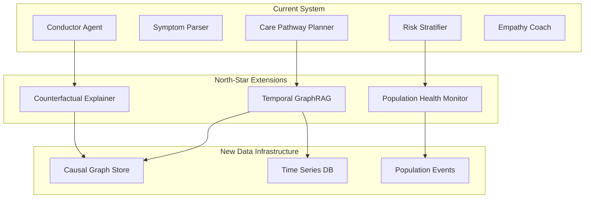
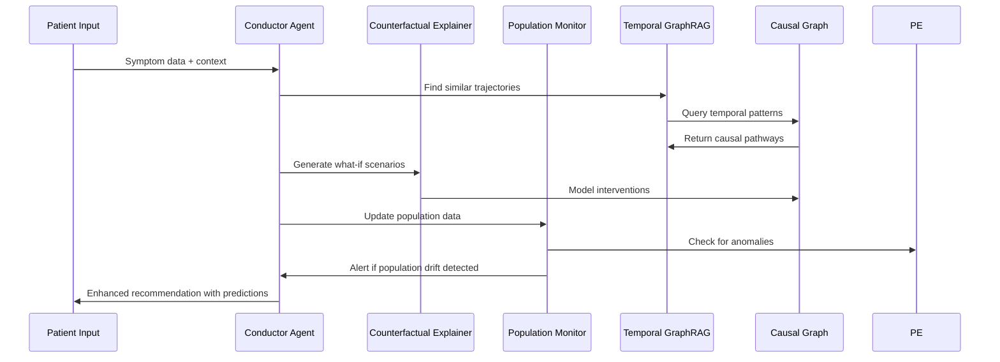
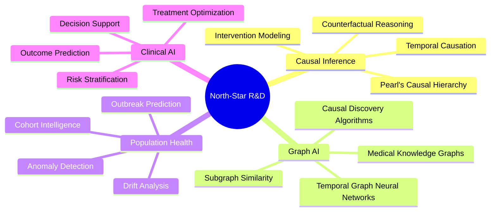

# North-Star Extensions & Moonshot Goals

This document outlines revolutionary features that will transform the Multi-Agent Medical Triage Conductor from an individual patient triage system into a next-generation predictive healthcare intelligence platform.

## 🌟 Vision Statement

**Current State**: AI-powered individual patient triage with symptom analysis and care pathway recommendations.

**Future Vision**: A comprehensive healthcare intelligence system that performs causal reasoning, population health monitoring, and predictive intervention modeling to revolutionize medical decision-making.

---

## 🎯 Three Revolutionary Moonshot Features

### 1. **Counterfactual Explainer Agent** 
*"If GTN had been given earlier, predicted pain trajectory would be X."*

**Revolutionary Impact**: 
- First AI system to provide causal "what-if" analysis for medical interventions
- Enables clinicians to understand treatment timing effects before acting
- Transforms reactive medicine into predictive intervention planning

**Core Innovation**: Real-time causal inference modeling that can answer counterfactual questions about treatment outcomes, medication timing, and intervention sequences.

### 2. **Cross-Patient Early Warning System**
*"Cohort-level drift detection (e.g., ward-wide viral spike identification)"*

**Revolutionary Impact**:
- Population-level anomaly detection for outbreak prevention
- Real-time epidemiological intelligence at the clinical level
- Transforms individual patient care into community health protection

**Core Innovation**: Statistical drift detection across patient cohorts to identify emerging health threats, seasonal patterns, and demographic-specific health trends in real-time.

### 3. **Temporal GraphRAG System**
*"Build causal event graph (med → lab response) and retrieve subgraphs for similar patient trajectories"*

**Revolutionary Impact**:
- First graph-based medical reasoning system for trajectory analysis
- Causal pathway visualization for complex multi-step treatments
- Enables pattern recognition across temporal medical sequences

**Core Innovation**: Replaces vector similarity with causal graph reasoning to find patients with similar medical journeys and predict intervention outcomes based on temporal event sequences.

---

## 🏗️ Technical Architecture Overview

### Integration with Current System

### Data Pipeline Evolution

---

## 🚀 Implementation Roadmap

### Phase 1: Foundation (6 months)
- **Research Partnerships**: Collaborate with medical schools for causal modeling validation
- **Data Infrastructure**: Build temporal event storage and causal graph database
- **Proof of Concept**: Implement basic counterfactual reasoning for medication timing

### Phase 2: Core Features (12 months)  
- **Counterfactual Engine**: Full causal inference system for treatment outcomes
- **Population Monitoring**: Statistical drift detection across patient cohorts
- **Graph RAG**: Temporal graph construction and similarity algorithms

### Phase 3: Integration (18 months)
- **Clinical Validation**: Partner with hospitals for real-world testing
- **Performance Optimization**: Real-time graph queries and population analytics
- **Regulatory Compliance**: FDA/CE marking preparation for predictive features

### Phase 4: Revolution (24 months)
- **Multi-Hospital Deployment**: Cross-institutional population health monitoring
- **Advanced Reasoning**: Causal pathway optimization and intervention planning
- **Research Platform**: Open-source medical AI research infrastructure

---

## 🔬 Research & Development Requirements

### Academic Partnerships Needed

1. **Causal Inference Research**
   - Stanford AI Lab (Causal ML)
   - MIT CSAIL (Temporal Reasoning)
   - CMU Machine Learning (Graph Neural Networks)

2. **Clinical Validation**
   - Mayo Clinic (Electronic Health Records)
   - Johns Hopkins (Population Health)
   - Mass General (Emergency Medicine)

3. **Ethics & Regulation**
   - Harvard Medical (AI Ethics)
   - FDA Digital Health Center
   - WHO Digital Health Initiative

### Technical Innovation Areas

---

## 🎓 Educational Impact

### Medical School Integration
- **Curriculum Enhancement**: Teaching causal reasoning in medical decision-making
- **Research Training**: Next-generation medical AI research methodologies
- **Clinical Simulation**: What-if analysis training for medical students

### Healthcare Professional Development
- **Continuing Education**: Population health monitoring certification
- **Decision Support Training**: Using causal AI for treatment planning
- **Quality Improvement**: Outcome prediction for process optimization

---

## 🌍 Global Health Impact

### Transformative Applications

1. **Pandemic Preparedness**
   - Early outbreak detection through population drift monitoring
   - Counterfactual analysis of intervention timing effects
   - Cross-regional health pattern analysis

2. **Personalized Medicine**
   - Individual treatment trajectory optimization
   - Genetic-environmental interaction modeling
   - Precision intervention timing

3. **Health Equity**
   - Population-specific health pattern recognition
   - Disparities detection through cohort analysis
   - Equitable resource allocation optimization

### Societal Benefits
- **Reduced Healthcare Costs**: Predictive interventions prevent complications
- **Improved Outcomes**: Causal reasoning optimizes treatment sequences  
- **Public Health Protection**: Population monitoring prevents outbreaks
- **Research Acceleration**: Open platform for medical AI advancement

---

## ⚖️ Ethical Considerations & Safeguards

### Privacy Protection
- **Differential Privacy**: Population analytics without individual exposure
- **Federated Learning**: Cross-institutional analysis without data sharing
- **Consent Management**: Granular control over data usage and research participation

### Clinical Safety
- **Validation Requirements**: Rigorous clinical trial validation for predictive features
- **Human Override**: Clinician authority over AI recommendations
- **Transparency**: Full explainability of causal reasoning chains
- **Bias Mitigation**: Continuous monitoring for demographic and institutional biases

### Regulatory Compliance
- **FDA Pathway**: Software as Medical Device (SaMD) certification
- **GDPR/HIPAA**: Privacy-by-design architecture
- **Clinical Guidelines**: Integration with existing medical standards
- **International Standards**: WHO Digital Health compliance

---

## 🏆 Success Metrics

### Clinical Impact Measurements
- **Diagnostic Accuracy**: Improvement in triage precision with causal reasoning
- **Outcome Prediction**: Accuracy of counterfactual treatment scenarios
- **Outbreak Detection**: Time-to-identification for population health events
- **Treatment Optimization**: Patient outcome improvements with AI-guided interventions

### Research Contributions
- **Publications**: Peer-reviewed papers on medical causal AI
- **Open Source**: Community contributions to medical AI research
- **Patents**: Innovative algorithms for healthcare applications
- **Standards**: Contribution to medical AI regulatory frameworks

### Adoption & Scale
- **Hospital Partners**: Number of institutions using the platform
- **Patient Impact**: Lives improved through predictive interventions
- **Cost Savings**: Healthcare system efficiency improvements
- **Global Reach**: International deployment and localization

---

This document serves as the technical and strategic foundation for transforming individual patient triage into a revolutionary healthcare intelligence platform that will fundamentally change how medicine is practiced and how health outcomes are optimized at both individual and population levels.