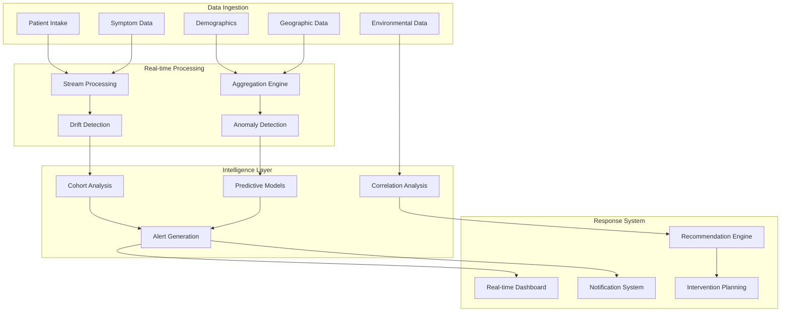
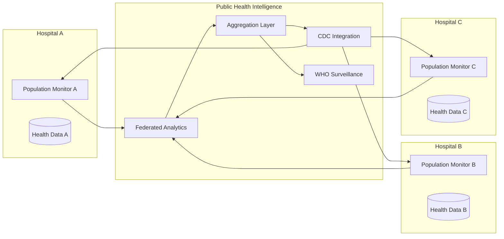

# Cross-Patient Early Warning System

> *"Cohort-level drift detection (e.g., ward-wide viral spike identification)"*

## 🌍 Revolutionary Vision

The Cross-Patient Early Warning System transforms individual patient triage into a population health intelligence platform. By analyzing patterns across patient cohorts in real-time, this system can detect emerging health threats, seasonal outbreaks, and demographic-specific health trends before they become widespread problems.

---

## 🚨 Core Capabilities

### 1. Outbreak Detection & Prevention
**Real-world Impact**: *"System detects 300% increase in respiratory symptoms across 3 wards over 48 hours, predicting viral outbreak 5 days before clinical recognition."*

```typescript
interface OutbreakDetection {
  // Statistical anomaly detection
  baselineMetrics: {
    symptomFrequency: Map<string, number>;
    demographicDistribution: DemographicPattern;
    temporalTrends: TimeSeries<SymptomFrequency>;
    seasonalPatterns: SeasonalPattern[];
  };
  
  // Real-time drift detection
  currentMetrics: {
    symptomSpike: {
      symptom: string;
      currentFrequency: number;
      historicalAverage: number;
      standardDeviations: number;
      pValue: number;
    }[];
    
    geographicClustering: {
      ward: string;
      building: string;
      zipCode: string;
      clusterSize: number;
      clusterDensity: number;
    }[];
    
    temporalAcceleration: {
      symptom: string;
      growthRate: number;
      doublingTime: number;
      confidenceInterval: [number, number];
    }[];
  };
  
  // Alert generation
  alerts: {
    level: 'watch' | 'warning' | 'critical';
    probability: number;
    timeToOutbreak: number;
    recommendedActions: string[];
    affectedPopulation: number;
  }[];
}
```

### 2. Demographic Health Intelligence
**Real-world Impact**: *"System identifies that diabetes patients over 65 are experiencing 40% higher respiratory complications during winter months, enabling targeted preventive interventions."*

```typescript
interface DemographicIntelligence {
  // Population stratification
  cohorts: {
    definition: DemographicCriteria;
    size: number;
    healthBaseline: HealthMetrics;
    riskFactors: RiskFactor[];
  }[];
  
  // Comparative analysis
  cohortComparisons: {
    cohortA: string;
    cohortB: string;
    riskRatio: number;
    outcomeComparisons: OutcomeComparison[];
    statisticalSignificance: number;
    clinicalSignificance: boolean;
  }[];
  
  // Disparity detection
  healthDisparities: {
    disparity: string;
    affectedPopulation: DemographicGroup;
    magnitude: number;
    trend: 'improving' | 'worsening' | 'stable';
    contributingFactors: string[];
    interventionOpportunities: string[];
  }[];
}
```

### 3. Seasonal & Environmental Pattern Recognition
**Real-world Impact**: *"System predicts 25% increase in asthma presentations during high pollen days, enabling proactive care coordination and resource allocation."*

```typescript
interface EnvironmentalIntelligence {
  // Environmental correlation analysis
  environmentalFactors: {
    airQuality: AirQualityIndex;
    pollenCount: PollenData;
    weatherPatterns: WeatherData;
    seasonalTrends: SeasonalData;
  };
  
  // Health impact modeling
  environmentalHealthCorrelations: {
    factor: string;
    healthOutcomes: string[];
    correlation: number;
    lagTime: number;
    populationImpact: number;
    predictionAccuracy: number;
  }[];
  
  // Predictive alerts
  environmentalAlerts: {
    factor: string;
    predictedImpact: {
      symptomIncrease: number;
      affectedPopulation: number;
      timeframe: TimeWindow;
      confidence: number;
    };
    recommendations: {
      preventiveActions: string[];
      resourceAllocation: ResourceAllocation;
      patientNotifications: PatientAlert[];
    };
  }[];
}
```

---

## 🏗️ Technical Architecture

### Population Monitoring Pipeline



### Statistical Drift Detection Engine

```typescript
class PopulationHealthMonitor {
  private driftDetector: StatisticalDriftDetector;
  private cohortAnalyzer: CohortAnalyzer;
  private alertManager: AlertManager;
  private environmentalCorrelator: EnvironmentalCorrelator;
  
  constructor(
    historicalData: PopulationHealthHistory,
    environmentalAPIs: EnvironmentalDataProvider[]
  ) {
    this.driftDetector = new KullbackLeiblerDriftDetector();
    this.cohortAnalyzer = new BayesianCohortAnalyzer();
    this.alertManager = new MultiLevelAlertManager();
    this.environmentalCorrelator = new CausalEnvironmentalCorrelator();
  }
  
  async analyzePopulationHealth(
    currentData: PopulationSnapshot
  ): Promise<PopulationHealthAnalysis> {
    
    // 1. Detect statistical drift in symptom patterns
    const driftAnalysis = await this.detectSymptomDrift(currentData);
    
    // 2. Analyze demographic cohorts for disparities
    const cohortAnalysis = await this.analyzeCohortHealth(currentData);
    
    // 3. Correlate with environmental factors
    const environmentalAnalysis = await this.analyzeEnvironmentalFactors(currentData);
    
    // 4. Generate predictive alerts
    const alerts = await this.generateAlerts(driftAnalysis, cohortAnalysis, environmentalAnalysis);
    
    // 5. Recommend interventions
    const recommendations = await this.generateRecommendations(alerts);
    
    return {
      timestamp: new Date(),
      driftAnalysis,
      cohortAnalysis,
      environmentalAnalysis,
      alerts,
      recommendations,
      confidence: this.calculateOverallConfidence([
        driftAnalysis.confidence,
        cohortAnalysis.confidence,
        environmentalAnalysis.confidence
      ])
    };
  }
  
  private async detectSymptomDrift(
    currentData: PopulationSnapshot
  ): Promise<DriftAnalysis> {
    
    // Kullback-Leibler divergence for distribution drift
    const symptomDistributions = this.extractSymptomDistributions(currentData);
    const historicalDistributions = await this.getHistoricalDistributions();
    
    const driftMetrics = symptomDistributions.map(current => {
      const historical = historicalDistributions.find(h => h.symptom === current.symptom);
      
      return {
        symptom: current.symptom,
        klDivergence: this.calculateKLDivergence(historical.distribution, current.distribution),
        pValue: this.calculateSignificance(historical, current),
        effectSize: this.calculateEffectSize(historical, current),
        drift: this.classifyDrift(current.klDivergence)
      };
    });
    
    return {
      driftMetrics,
      overallDriftScore: this.calculateOverallDrift(driftMetrics),
      significantDrifts: driftMetrics.filter(d => d.pValue < 0.05),
      confidence: this.calculateDriftConfidence(driftMetrics)
    };
  }
}
```

### Multi-dimensional Cohort Analysis

```typescript
interface CohortDefinition {
  name: string;
  criteria: {
    age?: AgeRange;
    gender?: Gender[];
    ethnicity?: Ethnicity[];
    comorbidities?: string[];
    medications?: string[];
    geography?: GeographicRegion;
    socioeconomic?: SocioeconomicStatus;
  };
  size: number;
  representativeness: number;
}

class BayesianCohortAnalyzer {
  async analyzeCohortHealth(
    populationData: PopulationSnapshot,
    cohorts: CohortDefinition[]
  ): Promise<CohortHealthAnalysis> {
    
    const cohortAnalyses = await Promise.all(
      cohorts.map(async cohort => {
        // Extract cohort-specific data
        const cohortData = this.filterByCohort(populationData, cohort);
        
        // Calculate health metrics
        const healthMetrics = this.calculateHealthMetrics(cohortData);
        
        // Compare with other cohorts
        const comparativeAnalysis = await this.performComparativeAnalysis(
          cohort, healthMetrics, cohorts
        );
        
        // Detect health disparities
        const disparities = this.detectHealthDisparities(
          cohort, healthMetrics, comparativeAnalysis
        );
        
        // Predict health risks
        const riskPredictions = await this.predictCohortRisks(cohort, healthMetrics);
        
        return {
          cohort,
          healthMetrics,
          comparativeAnalysis,
          disparities,
          riskPredictions,
          interventionOpportunities: this.identifyInterventionOpportunities(
            disparities, riskPredictions
          )
        };
      })
    );
    
    return {
      timestamp: new Date(),
      cohortAnalyses,
      crossCohortPatterns: this.identifyCrossCohortPatterns(cohortAnalyses),
      populationSummary: this.generatePopulationSummary(cohortAnalyses),
      confidence: this.calculateAnalysisConfidence(cohortAnalyses)
    };
  }
}
```

---

## 🌐 Integration with Public Health Systems

### Multi-institutional Data Sharing



### Privacy-Preserving Analytics

```typescript
interface FederatedPopulationAnalytics {
  // Differential privacy for population statistics
  differentialPrivacy: {
    epsilon: number;           // Privacy budget
    delta: number;            // Privacy parameter
    noiseLevel: number;       // Added statistical noise
    accuracyTradeoff: number; // Accuracy vs privacy trade-off
  };
  
  // Federated learning for cross-institutional patterns
  federatedLearning: {
    institutions: Institution[];
    modelUpdates: ModelUpdate[];
    aggregationStrategy: 'average' | 'weighted' | 'secure';
    privacyGuarantees: PrivacyGuarantee[];
  };
  
  // Secure multi-party computation for sensitive analyses
  secureMPC: {
    parties: Institution[];
    computation: string;
    inputs: EncryptedInput[];
    outputs: EncryptedOutput[];
    privacyLevel: 'semi-honest' | 'malicious';
  };
}
```

---

## 📊 Real-time Dashboard & Alerts

### Population Health Dashboard

```typescript
interface PopulationHealthDashboard {
  // Real-time metrics
  realTimeMetrics: {
    totalPatients: number;
    activeAlerts: Alert[];
    driftLevel: 'normal' | 'elevated' | 'critical';
    outbreakProbability: number;
  };
  
  // Trend visualizations
  trends: {
    symptomTrends: TimeSeries<SymptomFrequency>[];
    demographicTrends: DemographicTrend[];
    geographicHeatmap: GeographicPattern;
    seasonalPatterns: SeasonalVisualization;
  };
  
  // Predictive insights
  predictions: {
    shortTerm: Prediction[];      // Next 24-48 hours
    mediumTerm: Prediction[];     // Next week
    longTerm: Prediction[];       // Next month
    confidence: ConfidenceLevel;
  };
  
  // Intervention recommendations
  recommendations: {
    immediate: InterventionRecommendation[];
    preventive: PreventiveAction[];
    resourceAllocation: ResourceRecommendation[];
    patientNotifications: NotificationStrategy[];
  };
}
```

### Multi-level Alert System

```typescript
interface AlertSystem {
  // Alert levels
  alertLevels: {
    watch: {
      threshold: number;
      actions: string[];
      notifications: NotificationTarget[];
    };
    warning: {
      threshold: number;
      actions: string[];
      notifications: NotificationTarget[];
      escalation: EscalationProtocol;
    };
    critical: {
      threshold: number;
      actions: string[];
      notifications: NotificationTarget[];
      escalation: EscalationProtocol;
      emergencyProtocol: EmergencyResponse;
    };
  };
  
  // Smart notification routing
  notificationRouting: {
    recipients: {
      role: 'epidemiologist' | 'infection_control' | 'administration' | 'clinician';
      alertTypes: AlertType[];
      communicationChannels: Channel[];
      escalationTimeline: Timeline;
    }[];
  };
  
  // Alert fatigue prevention
  fatigueManagement: {
    intelligentThresholding: boolean;
    alertClustering: boolean;
    priorityScoring: boolean;
    feedbackLoop: boolean;
  };
}
```

---

## 🔬 Advanced Analytics

### Causal Inference for Population Health

```typescript
class PopulationCausalAnalyzer {
  async identifyPopulationCauses(
    populationData: PopulationTimeSeries,
    interventions: PopulationIntervention[]
  ): Promise<CausalAnalysis> {
    
    // Difference-in-differences for intervention effects
    const didAnalysis = await this.performDifferenceInDifferences(
      populationData, interventions
    );
    
    // Instrumental variables for unmeasured confounding
    const ivAnalysis = await this.performInstrumentalVariableAnalysis(
      populationData
    );
    
    // Regression discontinuity for policy effects
    const rdAnalysis = await this.performRegressionDiscontinuity(
      populationData, interventions
    );
    
    return {
      causalEffects: this.synthesizeCausalEvidence([
        didAnalysis, ivAnalysis, rdAnalysis
      ]),
      confidenceLevel: this.calculateCausalConfidence([
        didAnalysis, ivAnalysis, rdAnalysis
      ]),
      policyImplications: this.derivePolicyImplications(didAnalysis),
      interventionRecommendations: this.generateInterventionRecommendations(
        didAnalysis, rdAnalysis
      )
    };
  }
}
```

### Machine Learning Models for Outbreak Prediction

```typescript
interface OutbreakPredictionModel {
  // Time series forecasting
  timeSeriesModels: {
    arima: ARIMAModel;
    lstm: LSTMModel;
    prophet: ProphetModel;
    ensemble: EnsembleModel;
  };
  
  // Spatial-temporal modeling
  spatioTemporalModels: {
    spatialAutoregressive: SARModel;
    geographicWeighted: GWRModel;
    networkAnalysis: NetworkModel;
  };
  
  // Early warning indicators
  leadingIndicators: {
    indicator: string;
    leadTime: number;
    predictivePower: number;
    reliability: number;
  }[];
  
  // Model performance
  performance: {
    accuracy: number;
    precision: number;
    recall: number;
    f1Score: number;
    auc: number;
    falsePositiveRate: number;
  };
}
```

---

## 🌍 Global Health Impact

### Pandemic Preparedness

```typescript
interface PandemicPreparednessSystem {
  // Early detection capabilities
  earlyDetection: {
    novelPathogenDetection: boolean;
    unusualSymptomPatterns: boolean;
    rapidSpreadIdentification: boolean;
    crossBorderMonitoring: boolean;
  };
  
  // Response coordination
  responseCoordination: {
    alertNetworks: HealthSystem[];
    communicationProtocols: Protocol[];
    resourceSharingAgreements: Agreement[];
    interventionCoordination: CoordinationPlan;
  };
  
  // Capacity modeling
  capacityModeling: {
    hospitalCapacity: CapacityModel;
    staffingRequirements: StaffingModel;
    supplyChainRequirements: SupplyModel;
    surgePrediction: SurgeModel;
  };
}
```

### Health Equity Monitoring

```typescript
interface HealthEquityMonitor {
  // Disparity detection
  disparityMetrics: {
    accessDisparities: AccessMetric[];
    outcomeDisparities: OutcomeMetric[];
    treatmentDisparities: TreatmentMetric[];
    preventiveServiceDisparities: PreventiveMetric[];
  };
  
  // Social determinants integration
  socialDeterminants: {
    income: SocioeconomicData;
    education: EducationData;
    housing: HousingData;
    transportation: TransportationData;
    foodSecurity: FoodSecurityData;
  };
  
  // Intervention tracking
  equityInterventions: {
    intervention: string;
    targetPopulation: Population;
    outcomeChanges: OutcomeChange[];
    disparityReduction: DisparityChange[];
    sustainabilityMetrics: SustainabilityMetric[];
  }[];
}
```

---

## ⚖️ Ethical Considerations & Privacy

### Privacy Protection Framework

```typescript
interface PopulationPrivacyFramework {
  // Data minimization
  dataMinimization: {
    collectionPrinciples: DataPrinciple[];
    retentionPolicies: RetentionPolicy[];
    purposeLimitation: string[];
    consentManagement: ConsentFramework;
  };
  
  // Anonymization techniques
  anonymization: {
    kAnonymity: number;
    lDiversity: number;
    tCloseness: number;
    differentialPrivacy: DifferentialPrivacyParams;
  };
  
  // Bias mitigation
  biasMitigation: {
    algorithmicBias: BiasDetection[];
    representativeness: RepresentativenessCheck[];
    fairnessMetrics: FairnessMetric[];
    continuousMonitoring: MonitoringProtocol;
  };
}
```

### Community Engagement

```typescript
interface CommunityEngagement {
  // Stakeholder involvement
  stakeholders: {
    communityRepresentatives: Stakeholder[];
    patientAdvocates: Stakeholder[];
    ethicsCommittees: Stakeholder[];
    regulatoryBodies: Stakeholder[];
  };
  
  // Transparency measures
  transparency: {
    publicDashboards: Dashboard[];
    regularReporting: ReportingSchedule;
    algorithmExplainability: ExplanationFramework;
    decisionAccountability: AccountabilityFramework;
  };
  
  // Community benefit
  communityBenefit: {
    healthImprovements: HealthOutcome[];
    accessImprovements: AccessImprovement[];
    capacityBuilding: CapacityProgram[];
    economicBenefits: EconomicImpact[];
  };
}
```

---

## 📈 Validation & Performance Metrics

### System Performance Benchmarks

| Metric | Target | Measurement Method |
|--------|--------|--------------------|
| **Outbreak Detection Time** | 24-48 hours before clinical recognition | Retrospective analysis |
| **False Positive Rate** | <5% for critical alerts | Alert validation studies |
| **Population Coverage** | >90% of served population | Data completeness analysis |
| **Response Time** | <1 minute for real-time analysis | System performance monitoring |
| **Prediction Accuracy** | >80% for 7-day forecasts | Prospective validation |
| **Alert Relevance** | >85% clinically actionable | User feedback studies |

### Public Health Impact Metrics

```typescript
interface PublicHealthImpactMetrics {
  // Outbreak prevention
  outbreakPrevention: {
    outbreaksDetected: number;
    outbreaksPrevented: number;
    timeToDetection: number[];
    populationProtected: number;
  };
  
  // Health disparity reduction
  disparityReduction: {
    baselineDisparities: DisparityMeasure[];
    currentDisparities: DisparityMeasure[];
    reductionPercentage: number;
    affectedPopulations: Population[];
  };
  
  // Resource optimization
  resourceOptimization: {
    capacityUtilization: number;
    resourceWaste: number;
    costSavings: number;
    efficiencyGains: number;
  };
  
  // Population health outcomes
  populationOutcomes: {
    mortalityReduction: number;
    morbidityReduction: number;
    qualityOfLifeImprovement: number;
    preventableHospitalizations: number;
  };
}
```

---

This revolutionary system will transform healthcare from reactive individual treatment to proactive population health protection, enabling early detection of health threats, reduction of health disparities, and optimization of public health resources at unprecedented scale and speed.