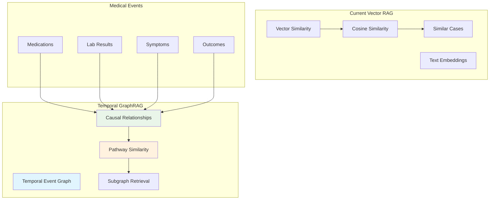
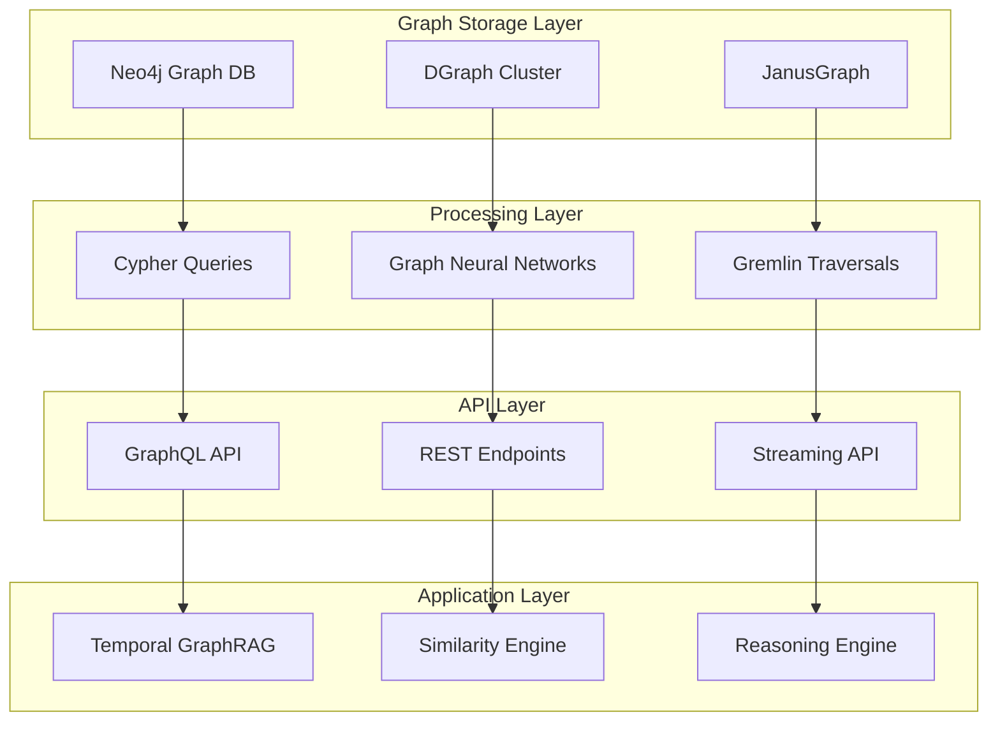

# Temporal GraphRAG System

> *"Build causal event graph (med → lab response) and retrieve subgraphs for similar patient trajectories"*

## 🎯 Revolutionary Vision

The Temporal GraphRAG System represents a paradigm shift from vector similarity search to causal graph reasoning. Instead of finding similar symptoms in a vector space, this system constructs temporal medical event graphs that capture causal relationships (medication → lab changes → outcomes) and retrieves similar patient journeys based on causal pathway analysis.

---

## 🧬 Graph-Based Medical Reasoning

### From Vector Similarity to Causal Pathways



### Temporal Event Graph Structure

```typescript
interface TemporalMedicalGraph {
  // Nodes: Medical events with timestamps
  nodes: {
    [nodeId: string]: {
      type: 'medication' | 'lab_result' | 'symptom' | 'procedure' | 'outcome';
      timestamp: Date;
      value: any;
      metadata: {
        confidence: number;
        source: string;
        clinician: string;
        context: MedicalContext;
      };
    };
  };
  
  // Edges: Causal relationships between events
  edges: {
    [edgeId: string]: {
      source: string;
      target: string;
      relationship: 'causes' | 'influences' | 'precedes' | 'enables' | 'inhibits';
      strength: number;
      timeDelay: number;
      confidence: number;
      evidenceLevel: 'A' | 'B' | 'C' | 'Expert';
      citations: Citation[];
    };
  };
  
  // Temporal constraints
  temporalConstraints: {
    orderingConstraints: TemporalOrdering[];
    durationConstraints: DurationConstraint[];
    frequencyPatterns: FrequencyPattern[];
  };
  
  // Causal pathways
  causalPathways: {
    pathwayId: string;
    nodes: string[];
    edges: string[];
    clinicalSignificance: number;
    outcomeImpact: number;
  }[];
}
```

---

## 🔗 Causal Event Graph Construction

### Medical Knowledge Graph Integration

```typescript
class MedicalKnowledgeGraphBuilder {
  async buildMedicalKnowledgeGraph(
    medicalLiterature: MedicalLiterature[],
    clinicalGuidelines: ClinicalGuideline[],
    expertKnowledge: ExpertKnowledge[]
  ): Promise<MedicalKnowledgeGraph> {
    
    // 1. Extract medical entities and relationships
    const entities = await this.extractMedicalEntities([
      ...medicalLiterature,
      ...clinicalGuidelines,
      ...expertKnowledge
    ]);
    
    // 2. Build causal relationship network
    const causalRelationships = await this.extractCausalRelationships(entities);
    
    // 3. Validate relationships with clinical evidence
    const validatedRelationships = await this.validateWithEvidence(
      causalRelationships, medicalLiterature
    );
    
    // 4. Assign temporal constraints
    const temporalConstraints = await this.extractTemporalConstraints(
      validatedRelationships
    );
    
    return new MedicalKnowledgeGraph(
      entities,
      validatedRelationships,
      temporalConstraints
    );
  }
  
  private async extractCausalRelationships(
    entities: MedicalEntity[]
  ): Promise<CausalRelationship[]> {
    
    const relationships = [];
    
    // Medication-Lab relationships
    const medLabRelations = await this.extractMedicationLabRelations(entities);
    relationships.push(...medLabRelations);
    
    // Lab-Symptom relationships
    const labSymptomRelations = await this.extractLabSymptomRelations(entities);
    relationships.push(...labSymptomRelations);
    
    // Symptom-Outcome relationships
    const symptomOutcomeRelations = await this.extractSymptomOutcomeRelations(entities);
    relationships.push(...symptomOutcomeRelations);
    
    // Complex multi-step pathways
    const complexPathways = await this.identifyComplexPathways(relationships);
    relationships.push(...complexPathways);
    
    return relationships;
  }
}
```

### Patient-Specific Graph Construction

```typescript
class PatientGraphBuilder {
  async buildPatientGraph(
    patientData: PatientHistory,
    knowledgeGraph: MedicalKnowledgeGraph
  ): Promise<PatientTemporalGraph> {
    
    // 1. Extract temporal medical events
    const temporalEvents = this.extractTemporalEvents(patientData);
    
    // 2. Map events to knowledge graph entities
    const mappedEvents = await this.mapToKnowledgeGraph(
      temporalEvents, knowledgeGraph
    );
    
    // 3. Identify causal relationships between patient events
    const patientCausalEdges = await this.identifyPatientCausalRelationships(
      mappedEvents, knowledgeGraph
    );
    
    // 4. Construct temporal ordering
    const temporalOrdering = this.establishTemporalOrdering(mappedEvents);
    
    // 5. Validate graph consistency
    const validatedGraph = this.validateGraphConsistency(
      mappedEvents, patientCausalEdges, temporalOrdering
    );
    
    return new PatientTemporalGraph(validatedGraph);
  }
  
  private async identifyPatientCausalRelationships(
    events: TemporalMedicalEvent[],
    knowledgeGraph: MedicalKnowledgeGraph
  ): Promise<CausalEdge[]> {
    
    const causalEdges: CausalEdge[] = [];
    
    // For each pair of temporally ordered events
    for (let i = 0; i < events.length; i++) {
      for (let j = i + 1; j < events.length; j++) {
        const earlierEvent = events[i];
        const laterEvent = events[j];
        
        // Check if knowledge graph supports causal relationship
        const knowledgeSupport = knowledgeGraph.getCausalRelationship(
          earlierEvent.type, laterEvent.type
        );
        
        if (knowledgeSupport) {
          // Calculate temporal plausibility
          const temporalPlausibility = this.calculateTemporalPlausibility(
            earlierEvent, laterEvent, knowledgeSupport
          );
          
          // Assess clinical plausibility
          const clinicalPlausibility = this.assessClinicalPlausibility(
            earlierEvent, laterEvent, knowledgeSupport
          );
          
          if (temporalPlausibility > 0.7 && clinicalPlausibility > 0.8) {
            causalEdges.push({
              source: earlierEvent.id,
              target: laterEvent.id,
              type: knowledgeSupport.type,
              confidence: Math.min(temporalPlausibility, clinicalPlausibility),
              evidence: knowledgeSupport.evidence
            });
          }
        }
      }
    }
    
    return causalEdges;
  }
}
```

---

## 🔍 Subgraph Similarity & Retrieval

### Pathway-Based Similarity Measurement

```typescript
class TemporalGraphRAG {
  private knowledgeGraph: MedicalKnowledgeGraph;
  private patientGraphs: Map<string, PatientTemporalGraph>;
  private pathwayExtractor: CausalPathwayExtractor;
  private similarityCalculator: GraphSimilarityCalculator;
  
  async findSimilarPatientJourneys(
    queryPatient: PatientTemporalGraph,
    similarityThreshold: number = 0.8
  ): Promise<SimilarPatientJourney[]> {
    
    // 1. Extract key causal pathways from query patient
    const queryPathways = await this.extractCausalPathways(queryPatient);
    
    // 2. Find patients with similar pathways
    const candidatePatients = await this.findCandidatePatients(queryPathways);
    
    // 3. Calculate detailed pathway similarity
    const similarityScores = await Promise.all(
      candidatePatients.map(async candidate => {
        const similarity = await this.calculatePathwaySimilarity(
          queryPathways, 
          await this.extractCausalPathways(candidate.graph)
        );
        
        return {
          patientId: candidate.patientId,
          graph: candidate.graph,
          similarity: similarity.overallSimilarity,
          pathwayMatches: similarity.pathwayMatches,
          temporalAlignment: similarity.temporalAlignment
        };
      })
    );
    
    // 4. Filter and rank by similarity
    const similarJourneys = similarityScores
      .filter(score => score.similarity >= similarityThreshold)
      .sort((a, b) => b.similarity - a.similarity);
    
    // 5. Generate insights from similar journeys
    const insights = await this.generatePathwayInsights(
      queryPatient, similarJourneys
    );
    
    return similarJourneys.map(journey => ({
      ...journey,
      insights: insights.get(journey.patientId) || []
    }));
  }
  
  private async calculatePathwaySimilarity(
    queryPathways: CausalPathway[],
    candidatePathways: CausalPathway[]
  ): Promise<PathwaySimilarity> {
    
    const pathwayMatches: PathwayMatch[] = [];
    let totalSimilarity = 0;
    let weightedSimilarity = 0;
    
    for (const queryPathway of queryPathways) {
      let bestMatch: PathwayMatch | null = null;
      let bestSimilarity = 0;
      
      for (const candidatePathway of candidatePathways) {
        // Calculate structural similarity (graph isomorphism)
        const structuralSimilarity = await this.calculateStructuralSimilarity(
          queryPathway, candidatePathway
        );
        
        // Calculate temporal similarity (timing patterns)
        const temporalSimilarity = await this.calculateTemporalSimilarity(
          queryPathway, candidatePathway
        );
        
        // Calculate semantic similarity (medical meaning)
        const semanticSimilarity = await this.calculateSemanticSimilarity(
          queryPathway, candidatePathway
        );
        
        // Combine similarities with weights
        const combinedSimilarity = (
          structuralSimilarity * 0.4 +
          temporalSimilarity * 0.3 +
          semanticSimilarity * 0.3
        );
        
        if (combinedSimilarity > bestSimilarity) {
          bestSimilarity = combinedSimilarity;
          bestMatch = {
            queryPathway,
            candidatePathway,
            structuralSimilarity,
            temporalSimilarity,
            semanticSimilarity,
            combinedSimilarity
          };
        }
      }
      
      if (bestMatch) {
        pathwayMatches.push(bestMatch);
        totalSimilarity += bestSimilarity;
        weightedSimilarity += bestSimilarity * queryPathway.clinicalSignificance;
      }
    }
    
    return {
      pathwayMatches,
      overallSimilarity: totalSimilarity / queryPathways.length,
      weightedSimilarity: weightedSimilarity / queryPathways.reduce(
        (sum, p) => sum + p.clinicalSignificance, 0
      ),
      temporalAlignment: this.calculateOverallTemporalAlignment(pathwayMatches)
    };
  }
}
```

### Graph Neural Network for Pathway Embedding

```typescript
class GraphNeuralNetworkEmbedder {
  private gnnModel: GraphTransformerModel;
  private nodeEmbedder: MedicalEntityEmbedder;
  private temporalEncoder: TemporalPositionalEncoder;
  
  async embedCausalPathway(
    pathway: CausalPathway
  ): Promise<PathwayEmbedding> {
    
    // 1. Create node embeddings for medical entities
    const nodeEmbeddings = await Promise.all(
      pathway.nodes.map(async node => {
        const entityEmbedding = await this.nodeEmbedder.embed(node.entity);
        const temporalEmbedding = this.temporalEncoder.encode(node.timestamp);
        const contextEmbedding = await this.embedMedicalContext(node.context);
        
        return this.combineEmbeddings([
          entityEmbedding,
          temporalEmbedding,
          contextEmbedding
        ]);
      })
    );
    
    // 2. Create edge embeddings for causal relationships
    const edgeEmbeddings = await Promise.all(
      pathway.edges.map(async edge => {
        const relationshipEmbedding = await this.embedCausalRelationship(edge);
        const strengthEmbedding = this.embedRelationshipStrength(edge.strength);
        const temporalDelayEmbedding = this.embedTemporalDelay(edge.timeDelay);
        
        return this.combineEmbeddings([
          relationshipEmbedding,
          strengthEmbedding,
          temporalDelayEmbedding
        ]);
      })
    );
    
    // 3. Apply graph transformer to get pathway embedding
    const pathwayEmbedding = await this.gnnModel.forward({
      nodes: nodeEmbeddings,
      edges: edgeEmbeddings,
      adjacencyMatrix: pathway.adjacencyMatrix
    });
    
    return {
      embedding: pathwayEmbedding,
      dimensionality: pathwayEmbedding.length,
      pathway,
      confidence: this.calculateEmbeddingConfidence(pathway, pathwayEmbedding)
    };
  }
}
```

---

## 🎯 Advanced Retrieval & Reasoning

### Multi-Modal Pathway Retrieval

```typescript
interface MultiModalPathwayQuery {
  // Structural constraints
  structuralConstraints: {
    pathwayLength: NumberRange;
    nodeTypes: MedicalEntityType[];
    edgeTypes: CausalRelationType[];
    requiredNodes: string[];
    forbiddenNodes: string[];
  };
  
  // Temporal constraints
  temporalConstraints: {
    totalDuration: DurationRange;
    nodeTimingConstraints: NodeTimingConstraint[];
    sequenceConstraints: SequenceConstraint[];
  };
  
  // Semantic constraints
  semanticConstraints: {
    clinicalContext: ClinicalContext;
    patientDemographics: Demographics;
    comorbidityConstraints: ComorbidityConstraint[];
    treatmentGoals: TreatmentGoal[];
  };
  
  // Outcome constraints
  outcomeConstraints: {
    desiredOutcomes: MedicalOutcome[];
    undesiredOutcomes: MedicalOutcome[];
    outcomeTimeframe: TimeWindow;
    outcomeConfidence: number;
  };
}

class AdvancedPathwayRetrieval {
  async queryPathways(
    query: MultiModalPathwayQuery
  ): Promise<RetrievedPathway[]> {
    
    // 1. Structural filtering
    const structurallyCompatible = await this.filterByStructure(query.structuralConstraints);
    
    // 2. Temporal filtering
    const temporallyCompatible = await this.filterByTemporalConstraints(
      structurallyCompatible, query.temporalConstraints
    );
    
    // 3. Semantic filtering
    const semanticallyCompatible = await this.filterBySemanticConstraints(
      temporallyCompatible, query.semanticConstraints
    );
    
    // 4. Outcome-based ranking
    const outcomeRanked = await this.rankByOutcomes(
      semanticallyCompatible, query.outcomeConstraints
    );
    
    // 5. Generate explanations
    const explainedResults = await this.generateRetrievalExplanations(
      outcomeRanked, query
    );
    
    return explainedResults;
  }
}
```

### Causal Pathway Reasoning

```typescript
class CausalPathwayReasoner {
  async reasonAboutPathway(
    pathway: CausalPathway,
    interventionPoint: InterventionPoint
  ): Promise<PathwayReasoning> {
    
    // 1. Identify intervention effects
    const interventionEffects = await this.analyzeInterventionEffects(
      pathway, interventionPoint
    );
    
    // 2. Predict downstream consequences
    const downstreamEffects = await this.predictDownstreamEffects(
      pathway, interventionPoint, interventionEffects
    );
    
    // 3. Identify alternative pathways
    const alternativePathways = await this.identifyAlternativePathways(
      pathway, interventionPoint
    );
    
    // 4. Assess pathway robustness
    const robustnessAnalysis = await this.assessPathwayRobustness(
      pathway, interventionPoint
    );
    
    // 5. Generate clinical insights
    const clinicalInsights = await this.generateClinicalInsights(
      pathway,
      interventionEffects,
      downstreamEffects,
      alternativePathways
    );
    
    return {
      pathway,
      interventionPoint,
      interventionEffects,
      downstreamEffects,
      alternativePathways,
      robustnessAnalysis,
      clinicalInsights,
      confidence: this.calculateReasoningConfidence([
        interventionEffects.confidence,
        downstreamEffects.confidence,
        robustnessAnalysis.confidence
      ])
    };
  }
}
```

---

## 🏗️ Technical Infrastructure

### Graph Database Architecture



### Scalable Graph Processing

```typescript
interface GraphProcessingCluster {
  // Distributed graph storage
  graphSharding: {
    shardingStrategy: 'temporal' | 'entity-based' | 'pathway-based';
    shards: GraphShard[];
    replicationFactor: number;
    consistencyLevel: 'eventual' | 'strong';
  };
  
  // Parallel processing
  parallelProcessing: {
    nodeProcessing: NodeProcessor[];
    edgeProcessing: EdgeProcessor[];
    pathwayProcessing: PathwayProcessor[];
    queryProcessing: QueryProcessor[];
  };
  
  // Caching strategy
  cachingStrategy: {
    pathwayCache: PathwayCache;
    similarityCache: SimilarityCache;
    embeddingCache: EmbeddingCache;
    queryCache: QueryCache;
  };
  
  // Performance optimization
  optimization: {
    indexingStrategy: IndexingStrategy;
    queryOptimization: QueryOptimizer;
    memoryManagement: MemoryManager;
    loadBalancing: LoadBalancer;
  };
}
```

---

## 🔬 Integration with Existing System

### Enhanced Memory-Augmented Risk Agent

```typescript
class TemporalGraphMemoryAugmentedRiskAgent extends MemoryAugmentedRiskAgent {
  private temporalGraphRAG: TemporalGraphRAG;
  private pathwayAnalyzer: CausalPathwayAnalyzer;
  
  constructor(
    provider: LlmProvider,
    vectorStore: VectorStore,
    embeddingService: EmbeddingService,
    temporalGraphDB: TemporalGraphDatabase
  ) {
    super(provider, vectorStore, embeddingService);
    
    this.temporalGraphRAG = new TemporalGraphRAG(temporalGraphDB);
    this.pathwayAnalyzer = new CausalPathwayAnalyzer();
  }
  
  async assessRisk(
    evidence: ClinicalEvidence,
    patientContext?: PatientContext
  ): Promise<RiskAssessmentWithPathways> {
    
    // 1. Standard risk assessment
    const baseRiskAssessment = await super.assessRisk(evidence, patientContext);
    
    // 2. Build patient temporal graph
    const patientGraph = await this.buildPatientGraph(evidence, patientContext);
    
    // 3. Find similar patient pathways
    const similarPathways = await this.temporalGraphRAG.findSimilarPatientJourneys(
      patientGraph, 0.75
    );
    
    // 4. Analyze pathway-based risk factors
    const pathwayRiskFactors = await this.analyzePathwayRisks(
      patientGraph, similarPathways
    );
    
    // 5. Predict potential pathways
    const predictedPathways = await this.predictLikelyPathways(
      patientGraph, similarPathways
    );
    
    // 6. Enhanced risk assessment
    const enhancedRisk = await this.combineRiskAssessments(
      baseRiskAssessment,
      pathwayRiskFactors,
      predictedPathways
    );
    
    return {
      ...enhancedRisk,
      pathwayAnalysis: {
        patientGraph,
        similarPathways,
        pathwayRiskFactors,
        predictedPathways,
        pathwayConfidence: this.calculatePathwayConfidence(similarPathways)
      }
    };
  }
  
  private async analyzePathwayRisks(
    patientGraph: PatientTemporalGraph,
    similarPathways: SimilarPatientJourney[]
  ): Promise<PathwayRiskAnalysis> {
    
    const riskAnalyses = await Promise.all(
      similarPathways.map(async pathway => {
        // Extract risk-relevant subgraphs
        const riskSubgraphs = await this.extractRiskSubgraphs(pathway.graph);
        
        // Analyze pathway outcomes
        const outcomeAnalysis = await this.analyzePathwayOutcomes(pathway);
        
        // Calculate risk contribution
        const riskContribution = this.calculatePathwayRiskContribution(
          riskSubgraphs, outcomeAnalysis
        );
        
        return {
          pathwayId: pathway.patientId,
          similarity: pathway.similarity,
          riskSubgraphs,
          outcomeAnalysis,
          riskContribution
        };
      })
    );
    
    return {
      pathwayRiskAnalyses: riskAnalyses,
      aggregatedRisk: this.aggregatePathwayRisks(riskAnalyses),
      highRiskPathways: riskAnalyses.filter(r => r.riskContribution > 0.7),
      protectivePathways: riskAnalyses.filter(r => r.riskContribution < 0.3)
    };
  }
}
```

---

## 📊 Clinical Decision Support Integration

### Pathway-Guided Treatment Recommendations

```typescript
interface PathwayGuidedRecommendation {
  // Current patient pathway
  currentPathway: {
    graph: PatientTemporalGraph;
    currentPosition: PathwayNode;
    trajectoryPrediction: TrajectoryPrediction;
  };
  
  // Similar successful pathways
  successfulPathways: {
    pathway: CausalPathway;
    similarity: number;
    outcome: SuccessfulOutcome;
    keyInterventions: MedicalIntervention[];
    criticalTimingPoints: TimingPoint[];
  }[];
  
  // Risk pathway alternatives
  riskPathways: {
    pathway: CausalPathway;
    riskLevel: number;
    avoidableFactors: RiskFactor[];
    interventionPoints: InterventionOpportunity[];
  }[];
  
  // Optimized intervention recommendations
  interventionRecommendations: {
    intervention: MedicalIntervention;
    optimalTiming: TimeWindow;
    expectedOutcomeImprovement: number;
    pathwayEvidence: PathwayEvidence[];
    confidence: number;
  }[];
}

class PathwayGuidedDecisionSupport {
  async generatePathwayGuidedRecommendations(
    currentPatient: PatientTemporalGraph,
    treatmentGoals: TreatmentGoal[]
  ): Promise<PathwayGuidedRecommendation> {
    
    // 1. Find pathways that achieved similar treatment goals
    const goalAchievingPathways = await this.findGoalAchievingPathways(
      treatmentGoals
    );
    
    // 2. Filter by patient similarity
    const similarGoalPathways = await this.filterBySimilarity(
      currentPatient, goalAchievingPathways, 0.7
    );
    
    // 3. Extract common intervention patterns
    const interventionPatterns = await this.extractInterventionPatterns(
      similarGoalPathways
    );
    
    // 4. Identify optimal timing windows
    const timingOptimization = await this.optimizeInterventionTiming(
      currentPatient, interventionPatterns
    );
    
    // 5. Generate evidence-based recommendations
    const recommendations = await this.generateEvidenceBasedRecommendations(
      currentPatient,
      similarGoalPathways,
      timingOptimization
    );
    
    return {
      currentPathway: {
        graph: currentPatient,
        currentPosition: this.identifyCurrentPosition(currentPatient),
        trajectoryPrediction: await this.predictTrajectory(currentPatient)
      },
      successfulPathways: similarGoalPathways,
      riskPathways: await this.identifyRiskPathways(currentPatient),
      interventionRecommendations: recommendations
    };
  }
}
```

---

## 🧪 Validation & Evaluation

### Graph Quality Metrics

```typescript
interface GraphQualityMetrics {
  // Structural quality
  structuralMetrics: {
    nodeConnectivity: number;
    pathwayCompleteness: number;
    temporalConsistency: number;
    causalValidation: number;
  };
  
  // Semantic quality
  semanticMetrics: {
    medicalAccuracy: number;
    clinicalRelevance: number;
    evidenceSupport: number;
    expertAgreement: number;
  };
  
  // Performance metrics
  performanceMetrics: {
    retrievalAccuracy: number;
    similarityPrecision: number;
    pathwayRelevance: number;
    clinicalUtility: number;
  };
  
  // Scalability metrics
  scalabilityMetrics: {
    queryResponseTime: number;
    memoryUsage: number;
    throughput: number;
    concurrentUsers: number;
  };
}
```

### Clinical Validation Framework

```typescript
interface ClinicalValidationStudy {
  // Retrospective validation
  retrospectiveValidation: {
    cases: ValidationCase[];
    pathwayAccuracy: number;
    outcomePrediction: number;
    interventionRecommendations: number;
    clinicianAgreement: number;
  };
  
  // Prospective validation
  prospectiveValidation: {
    studyDesign: 'observational' | 'interventional' | 'rct';
    participants: number;
    followUpDuration: number;
    primaryEndpoints: Endpoint[];
    secondaryEndpoints: Endpoint[];
  };
  
  // Clinical impact assessment
  clinicalImpact: {
    outcomeImprovement: number;
    timeToTreatment: number;
    treatmentOptimization: number;
    costEffectiveness: number;
    clinicianSatisfaction: number;
  };
}
```

---

## 🌟 Research Contributions & Innovation

### Novel Research Directions

1. **Temporal Graph Neural Networks for Medicine**
   - Graph transformer architectures for medical pathways
   - Temporal attention mechanisms for causal relationship modeling
   - Multi-scale temporal reasoning (minutes to years)

2. **Causal Discovery in Medical Data**
   - Automated causal relationship extraction from EHRs
   - Integration of observational data with randomized trial evidence
   - Temporal causal discovery algorithms

3. **Medical Pathway Similarity Metrics**
   - Novel graph kernel methods for pathway comparison
   - Semantic similarity measures for medical concepts
   - Clinical significance weighting for similarity calculations

4. **Federated Medical Graph Learning**
   - Privacy-preserving graph neural network training
   - Cross-institutional pathway knowledge sharing
   - Federated causal inference methods

### Open Source Contributions

```typescript
interface OpenSourceMedicalGraphLibrary {
  // Core graph components
  graphConstruction: {
    MedicalKnowledgeGraphBuilder: typeof MedicalKnowledgeGraphBuilder;
    PatientGraphBuilder: typeof PatientGraphBuilder;
    TemporalConstraintValidator: typeof TemporalConstraintValidator;
  };
  
  // Similarity and retrieval
  similarityMeasures: {
    PathwaySimilarityCalculator: typeof PathwaySimilarityCalculator;
    GraphKernelMethods: typeof GraphKernelMethods;
    SemanticSimilarityMeasures: typeof SemanticSimilarityMeasures;
  };
  
  // Machine learning models
  neuralNetworks: {
    GraphTransformerModel: typeof GraphTransformerModel;
    TemporalGCN: typeof TemporalGCN;
    CausalDiscoveryNet: typeof CausalDiscoveryNet;
  };
  
  // Evaluation frameworks
  evaluation: {
    ClinicalValidationFramework: typeof ClinicalValidationFramework;
    GraphQualityMetrics: typeof GraphQualityMetrics;
    BenchmarkDatasets: typeof BenchmarkDatasets;
  };
}
```

---

## 🎯 Success Metrics & Impact

### Technical Performance Targets

| Metric | Target | Current | Validation Method |
|--------|---------|---------|------------------|
| **Pathway Retrieval Accuracy** | 85% | TBD | Expert clinical validation |
| **Similarity Precision** | 80% | TBD | Retrospective case analysis |
| **Query Response Time** | <3 seconds | TBD | Performance benchmarking |
| **Graph Consistency** | 95% | TBD | Automated validation |
| **Clinical Relevance** | 90% | TBD | Clinician evaluation studies |

### Clinical Impact Objectives

```typescript
interface ClinicalImpactObjectives {
  // Primary outcomes
  primaryOutcomes: {
    treatmentOptimization: {
      target: 25%;
      measurement: 'improvement in treatment effectiveness';
      timeframe: '12 months';
    };
    
    diagnosisAcceleration: {
      target: 30;
      measurement: 'reduction in days to diagnosis';
      timeframe: '6 months';
    };
    
    outcomeImprovement: {
      target: 20%;
      measurement: 'improvement in patient outcomes';
      timeframe: '18 months';
    };
  };
  
  // Secondary outcomes
  secondaryOutcomes: {
    costReduction: {
      target: 15%;
      measurement: 'reduction in treatment costs';
      timeframe: '24 months';
    };
    
    clinicianSatisfaction: {
      target: 85%;
      measurement: 'satisfied with pathway insights';
      timeframe: '6 months';
    };
    
    researchAcceleration: {
      target: 50;
      measurement: 'new research papers enabled';
      timeframe: '36 months';
    };
  };
}
```

---

This revolutionary Temporal GraphRAG system will fundamentally transform medical AI from static symptom matching to dynamic pathway reasoning, enabling unprecedented insights into patient care trajectories and treatment optimization through causal graph intelligence.